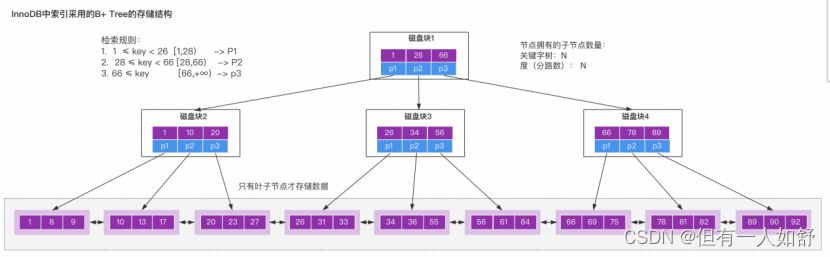

### Mysql索引的优点和缺点？

- 索引，是一种能够帮助Mysql高效从磁盘上检索数据的一种数据结构。
- 在Mysql中的InnoDB引擎中，采用了B+树的结构来实现索引和数据的存储
- 

#### Mysql里面的索引的优点有很多

1. 通过B+树的结构来存储数据，可以大大减少数据检索时的磁盘IO次数，从而提升数据查询的性能
2. B+树索引在进行范围查找的时候，只需要找到起始节点，然后基于叶子节点的链表结构往下读取即可，查询效率较高。
3. 通过唯一索引约束，可以保证数据表中每一行数据的唯一性

#### 缺点

- 当然，索引的不合理使用，也会有带来很多的缺点。

1. 数据的增加、修改、删除，需要涉及到索引的维护，当数据量较大的情况下，索引的维护会带来较大的性能开销。
2. 一个表中允许存在一个聚簇索引和多个非聚簇索引，但是索引数不能创建太多，否则造成的索引维护成本过高。
3. 创建索引的时候，需要考虑到索引字段值的分散性，如果字段的重复数据过多，创建索引反而会带来性能降低。

