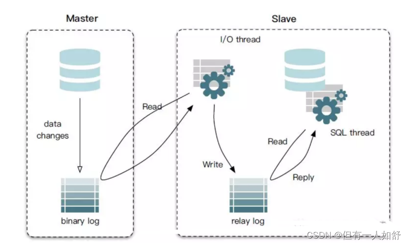

[TOC]

## binlog和redolog有什么区别？

- binlog和redolog都是Mysql里面用来记录数据库数据变更操作的日志。

### binlog

- 其中binlog主要用来做数据备份、数据恢复和数据同步，
- Mysql的主从数据同步的场景中，master节点的数据变更，会写入到binlog中，然后再把binlog中的数据通过网络传输给slave节点，实现数据同步。
- 

### 区别

- binlog和redolog的区别有很多，我可以简单总结三个点

#### 1. 场景

- binlog主要用来做数据备份、数据恢复、以及主从集群的数据同步；
- Redo Log主要用来实现Mysql数据库的事务恢复，保证事务的ACID特性。当数据库出现崩溃的时候，Redo Log可以把未提交的事务回滚，把已提交的事务进行持久化，从而保证数据的一致性和持久性。

#### 2. 信息不同

- 记录的信息不同，binlog是记录数据库的逻辑变化，它提供了三种日志格式分别是statement，row以及mixed；

#### 3. 记录时机不同

- redo log记录的是物理变化，也就是数据页的变化结果。
- binlog是在执行SQL语句的时候，在主线程中生成逻辑变化写入到磁盘中，所以它是语句级别的记录方式；
- RedoLog是在InnoDB存储引擎层面的操作，它是在Mysql后台线程中生成并写入到磁盘中的，所以它是事务级别的记录方式，一个事务操作完成以后才会被写入到redo log中。

