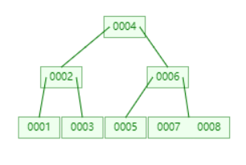
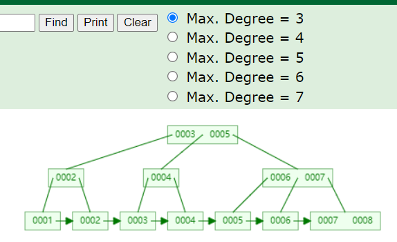

[TOC]

### 模拟B树网站

- [目录](https://www.cs.usfca.edu/~galles/visualization/Algorithms.html)
- [生成B树](https://www.cs.usfca.edu/~galles/visualization/BTree.html)
- [生成B+树](https://www.cs.usfca.edu/~galles/visualization/BPlusTree.html)

### 树结构示例图

- 
- 

### B+树

1. 一个节点有多个元素
2. 排序
3. 叶子结点有指针
4. 非叶子节点的数据都冗余了一份
5. B+树节点有多个元素
6. 在B树的叶子节点上加了双向指针

