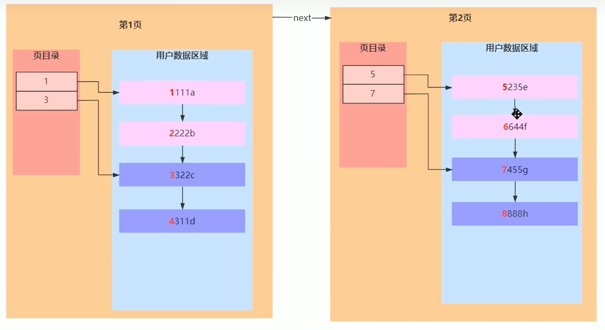

[TOC]

### Page

- 就是一个节点，页

~~~sql
select 16384/1024
~~~

- 一页是16kb
- 每次取出16kb，速度快
- 插入的时候是排序的
- 
- 

#### 分析

~~~
- 假设数据是int类型
- 每一页都是16kb
- 一个指针6b
- 一个 int ，4b，一条数据一共
- 6b + 4b = 10b 
- 16*1024/10 = 1638.4000
- 第二层一页，对应多少页第三层
- 两层能存多少数据 638 * 16 = 26208
- 假设一条记录 1kb，一页就是 16kb/1kb=16 条数据
- 假设三层能存多少数据 1638 * 1638 * 16 = 42928704

- int
SELECT 16*1024/(4+6);
- 第一层 一共一页 存 1638数据
- 第二层一共 1638页
- 第三层一页 16条数据
SELECT 1638 * 1638 * 16;

- bigint 
- 1170.2857 
SELECT 16*1024/(8+6);
- 21902400，两千多万 数据
- 一页里面存
SELECT 1170 * 1170 * 16;
~~~

#### User Records

#### Page Directory

### 三层B+树能存多少数据

- 为什么一个表存2千w数据

