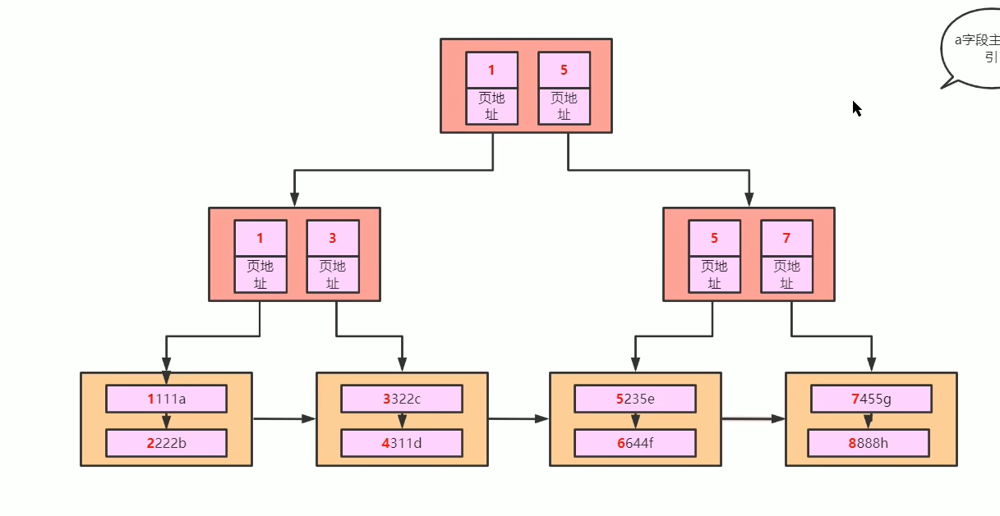
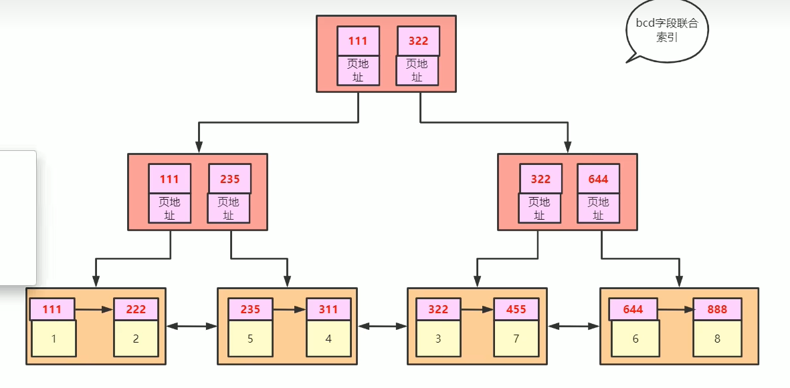

[TOC]

- Innodb是如何支持范围查找能走索引的
- 
    - 12层，索引页
    - 第三层，数据页
    - 可以叫做，聚集索引或者聚簇索引，也就是主键索引

### 主键索引

~~~
-- 查看索引类型
-- index_type   BTREE
SHOW INDEX FROM cc_novel ;
~~~

#### 为什么范围查询走索引

- 因为是排好序的，先找到等于，之后的就是大于
- 双向链表，所以小于也走索引

### 联合索引

- 看sql里面的示例脚本
- 这个时候B+树，里面存的就是bdc的值而不是主键值
- 
- 叶子结点存的是联合索引和主键

#### 回表

- 根据联合索引找到主键
- 再根据主键索引去找数据，这个过程叫做回表

#### 最左前缀原则

- 和where后面的顺序是没有关系的
- 只看查询的条件有没有，联合索引左边的字段

#### 范围查询有可能导致索引失效

- 因为要回表
- 看查询结果和全表的比较，不一定会走索引

