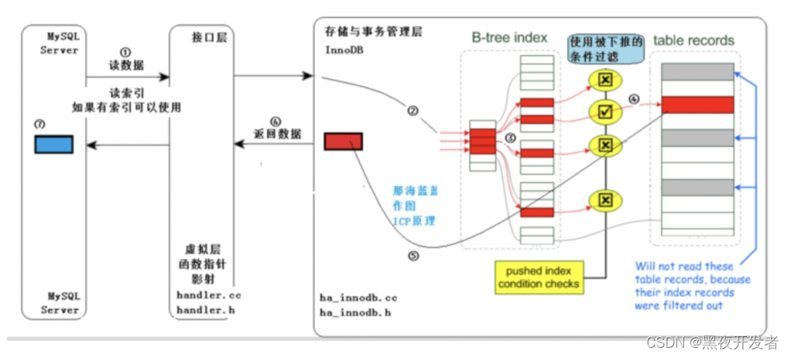
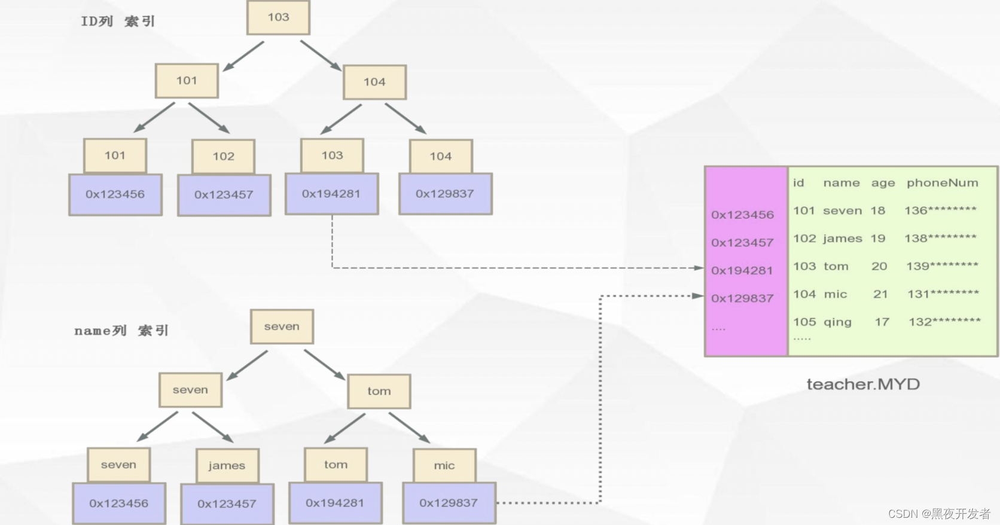
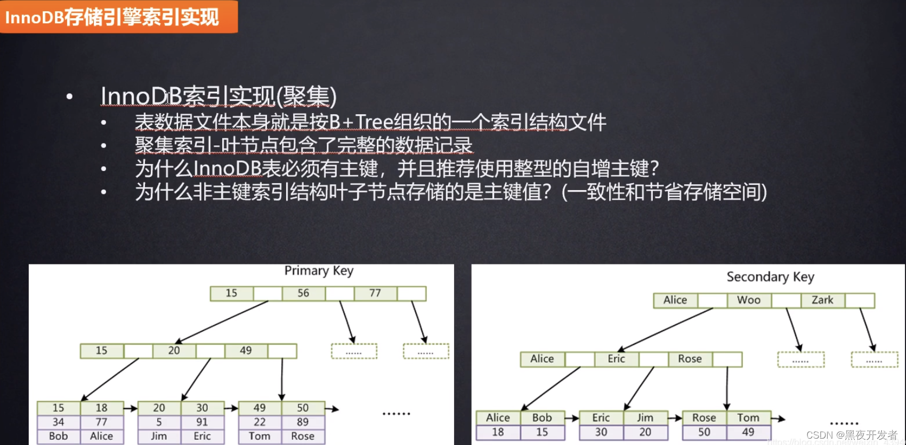

[TOC]

- [原文-MySQL回表是什么？哪些情况下会回表](https://blog.csdn.net/qq_21891743/article/details/132484295)

### 一. 什么是MySQL的回表？

- 在MySQL数据库中，回表（Look Up）指的是在进行索引查询时，首先通过索引定位到对应页，然后再根据行的物理地址找到所需的数据行。换句话说，回表是指根据索引查询到的主键值再去访问主键索引，从而获取完整的数据记录。
- 

### 二、什么情况下会触发回表？

- MySQL的回表操作通常在以下情况下会发生：

#### 2.1 索引不Cover所有需要查询的字段

- 当查询语句中需要返回的列不在索引列上时，即使通过索引定位了相关行，仍然需要回表获取其他列的值。

#### 2.2 使用了非聚簇索引

- 非聚簇索引（Secondary Index）只包含了索引列的副本以及指向对应主键的引用，查询需要通过回表才能获取完整的行数据。
- 

#### 2.3 使用了覆盖索引但超过了最大索引长度

- 在MySQL的InnoDB存储引擎中，每个索引项的最大长度是767字节，如果查询需要返回的字段长度超过了该限制，同样会触发回表操作。
- 需要注意的是，回表操作主要发生在读取操作（SELECT）中，写入操作（INSERT、UPDATE、DELETE）一般不会触发回表。

### 三、哪些情况下不会触发回表？

- 在某些特殊情况下，MySQL的回表操作可以被避免：

#### 3.1 覆盖索引

- 如果查询的字段都在某个索引上，并且没有超过最大索引长度限制，MySQL可以直接从索引中获取所需数据，而无需回表。

#### 3.2 使用聚簇索引

- InnoDB存储引擎的主键索引是聚簇索引，它包含了整个行的数据。当查询条件使用了主键或者通过主键查询时，MySQL可以直接从主键索引中获取所有需要的数据，无需回表。
- 

### 四、回表操作的问题和场景

- 回表操作虽然提供了更全面的数据信息，但也带来了一些问题和局限性。

#### 4.1 性能问题

- 回表操作通常需要访问两次索引，增加了IO开销和CPU消耗，对查询性能有一定的影响。特别是在高并发、大数据量的情况下，回表可能成为性能瓶颈。

#### 4.2 数据一致性

- 由于回表操作是基于物理地址来获取数据，如果在回表过程中发生了数据修改（如DELETE、UPDATE），则可能会读取到不一致或错误的数据。

#### 4.3 是否使用覆盖索引的判断

- 在选择是否使用覆盖索引时，需要综合考虑查询的字段以及字段长度，以及查询操作的频率和数据量。如果查询需要返回的字段较多或字段长度较长，可能需要权衡回表带来的性能损耗和数据完整性的需求。
- 在实际应用中，我们可以根据具体的场景来决定是否使用回表操作。下面列举了一些使用回表的典型

##### 4.3.1 需要返回更全面的数据

- 有些查询场景下，返回的字段可能不仅仅是索引所包含的列，此时回表可以提供更全面的数据信息。

##### 4.3.2 使用非聚簇索引

- 当表中没有定义主键或者查询条件没有使用主键时，非聚簇索引成为主要的索引选择，但回表操作则难以避免。

##### 4.3.3 超过最大索引长度限制

- 如果需要返回的字段长度超过了最大索引长度限制，即使使用了覆盖索引也无法避免回表，此时需要注意回表带来的性能损耗。

