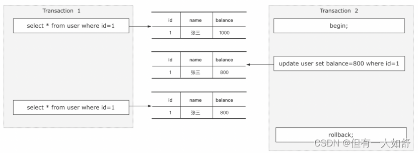
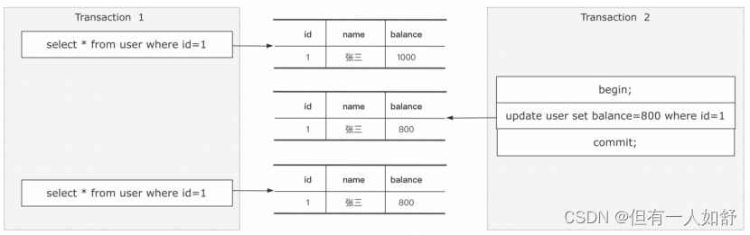
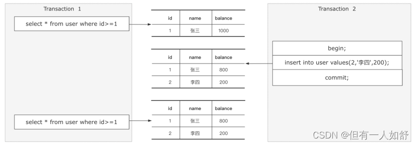

### 请你简单说一下Mysql的事务隔离级别

- 事务隔离级别，是为了解决多个并行事务竞争导致的数据安全问题的一种规范。
- 具体来说，多个事务竞争可能会产生三种不同的现象。

#### 0. 常见情况

- 而这三种现象在实际应用中，可能有些场景不能接受某些现象的存在，所以在SQL标准中定义了四种隔离级别，分别是：

1. 读未提交（RN)，在这种隔离级别下，可能会产生脏读、不可重复读、幻读。
2. 读已提交（RC)，在这种隔离级别下，可能会产生不可重复读和幻读。
3. 可重复读（RR），在这种隔离级别下，可能会产生幻读
4. 串行化，在这种隔离级别下，多个并行事务串行化执行，不会产生安全性问题。

- 这四种隔离级别里面，只有串行化解决了全部的问题，但也意味着这种隔离级别的性能是最低的。

#### 1. 读未提交-RN-脏读

1. 假设有两个事务T1/T2同时在执行，T1事务有可能会读取到T2事务未提交的数据，但是未提交的事务T2可能会回滚，也就导致了T1事务读取到最终不一定存在的数据产生脏读的现象。

- 

#### 2. 读已提交-RC-不可重复读

2. 假设有两个事务T1/T2同时执行，事务T1在不同的时刻读取同一行数据的时候结果可能不一样，从而导致不可重复读的问题。

- 

#### 3. 读已提交-RR-幻读

3. 假设有两个事务T1/T2同时执行，事务T1执行范围查询或者范围修改的过程中，事务T2插入了一条属于事务T1范围内的数据并且提交了，这时候在事务T1查询发现多出来了一条数据，或者在T1事务发现这条数据没有被修改，看起来像是产生了幻觉，这种现象称为幻读。

- 

#### 4. 串行化

- 会给每一行读取的数据加锁
- 会导致大量超时和锁竞争的问题

