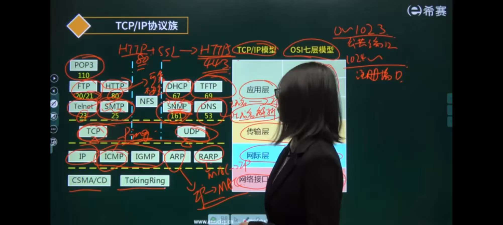
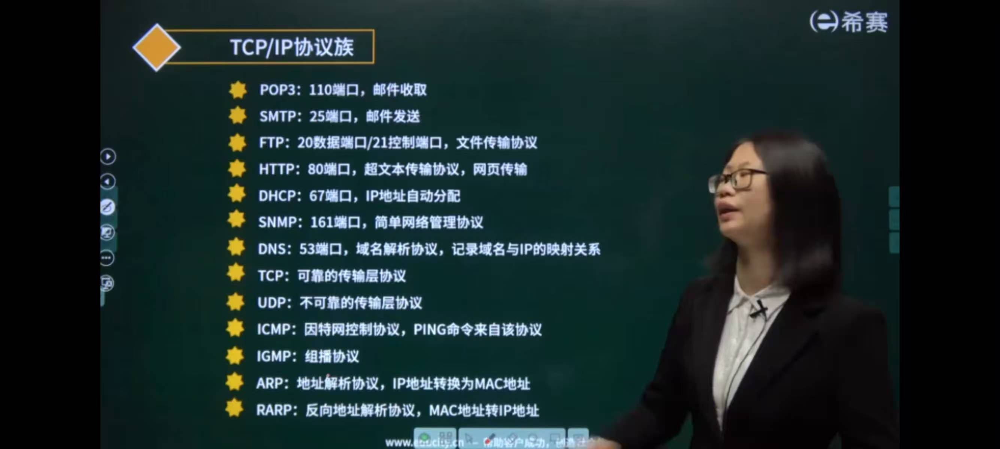
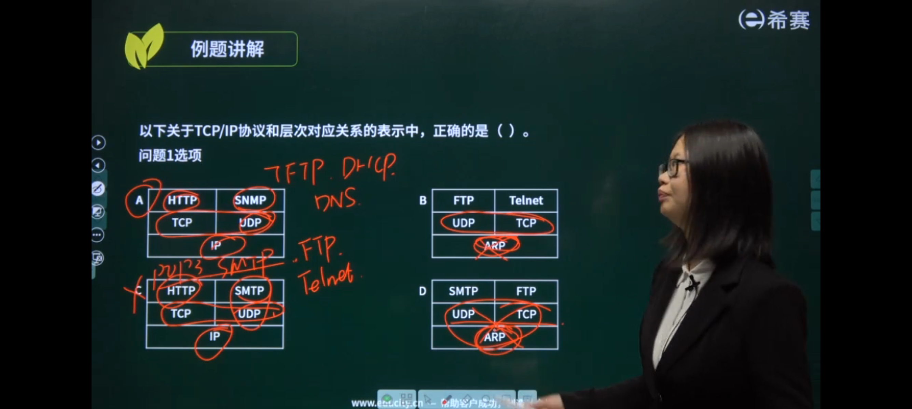



- 
- 
- 

### TCP-IP协议簇概述

| 协议         | 全称                                  | 中文名称           | 端口号                    | 传输层协议             | 功能描述         | 应用场景                                         |
| -------------- | --------------------------------------- | -------------------- | --------------------------- | ------------------------ | ------------------ | -------------------------------------------------- |
| **POP3**     | Post Office Protocol version 3        | 邮局协议第3版      | 110                       | TCP                    | 邮件接收         | 邮件接收服务                                     |
| **SMTP**     | Simple Mail Transfer Protocol         | 简单邮件传输协议   | 25                        | TCP                    | 邮件发送         | 邮件发送服务                                     |
| **FTP**      | File Transfer Protocol                | 文件传输协议       | 20(数据连接)/21(控制连接) | TCP                    | 文件传输服务     | 文件上传下载服务                                 |
| **SSH**      | Secure Shell                          | 安全外壳协议       | 22                        | TCP                    | 加密远程访问     | 安全远程管理                                     |
| **Telnet**   | Terminal Network                      | 终端网络协议       | 23                        | TCP                    | 远程终端访问     | 远程登录服务                                     |
| **HTTP**     | HyperText Transfer Protocol           | 超文本传输协议     | 80                        | TCP                    | Web内容传输      | Web浏览器访问网页                                |
| **HTTPS**    | HyperText Transfer Protocol Secure    | 安全超文本传输协议 | 443                       | TCP                    | 加密Web内容传输  | 安全Web访问                                      |
| **DHCP**     | Dynamic Host Configuration Protocol   | 动态主机配置协议   | 服务器67/客户端68                     | UDP                    | 自动网络配置     | 自动分配IP地址                                   |
| **SNMP**     | Simple Network Management Protocol    | 简单网络管理协议   | 161                       | UDP                    | 网络设备管理     | 网络监控和管理                                   |
| **DNS**      | Domain Name System                    | 域名系统           | 53                        | UDP/TCP                | 域名解析         | 域名与IP地址转换                                 |
| **ICMP**     | Internet Control Message Protocol     | 网际控制报文协议   | 无端口号（网络层协议）    | 无（基于 IP 协议承载） | 因特网控制协议   | PING命令来自该协议                               |
| **IGMP**     | Internet Group Management Protocol    | 网际组管理协议     | 无端口号（网络层协议）    | 无（基于 IP 协议承载） | 组播协议         | 视频直播、网络广播、多媒体组播分发等组播通信场景 |
| **ARP**      | Address Resolution Protocol           | 地址解析协议       | 无端口号（网络层协议）    | 无（数据链路层帧承载） | 地址解析协议     | IP地址转换为MAC地址                              |
| **RARP**     | Reverse Address Resolution Protocol   | 反向地址解析协议   | 无端口号（网络层协议）    | 无（数据链路层帧承载） | 反向地址解析协议 | MAC地址转换为IP地址                              |
| ------------ | ------------------------------------- | -----------        | -------------------       | ---------              | -----------      | ------------                                     |
| **IMAP**     | Internet Message Access Protocol      | 互联网消息访问协议 | 143                       | TCP                    | 邮件访问         | 在线邮件管理                                     |
| **TFTP**     | Trivial File Transfer Protocol        | 简单文件传输协议   | 69                        | UDP                    | 简单文件传输     | 网络引导，固件升级                               |
| **NFS**      | Network File System                   | 网络文件系统       | 2049                      | TCP/UDP                | 网络文件共享     | 远程文件访问                                     |

