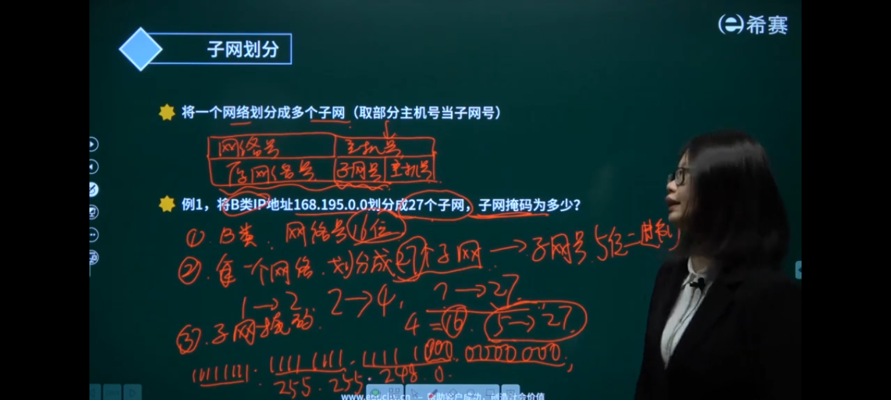
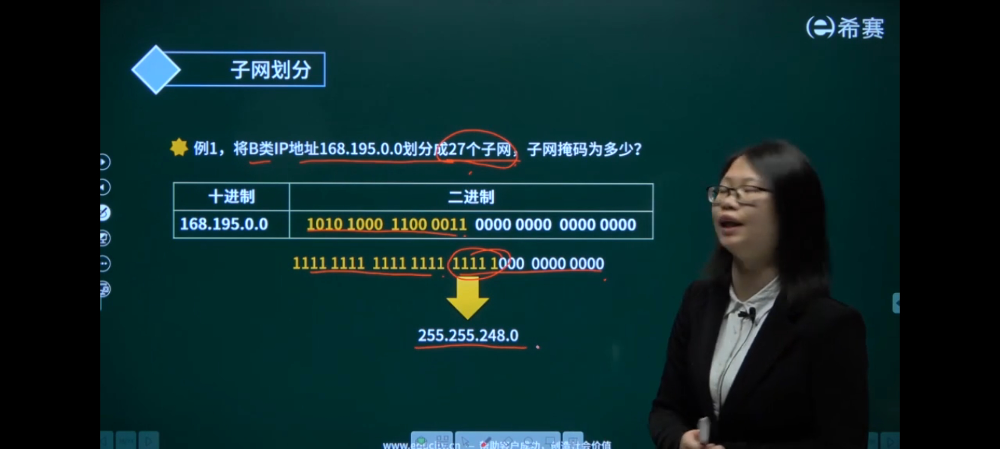
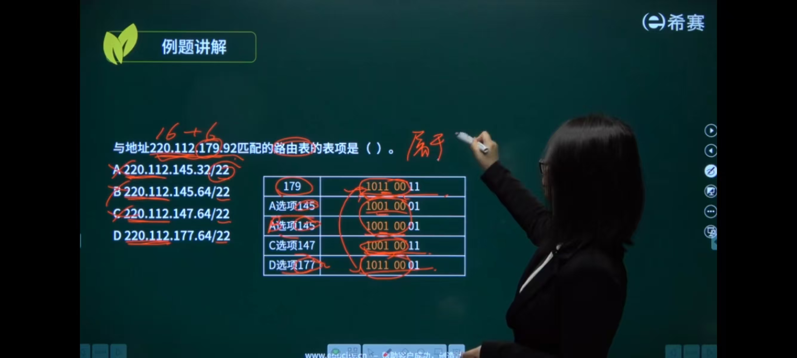
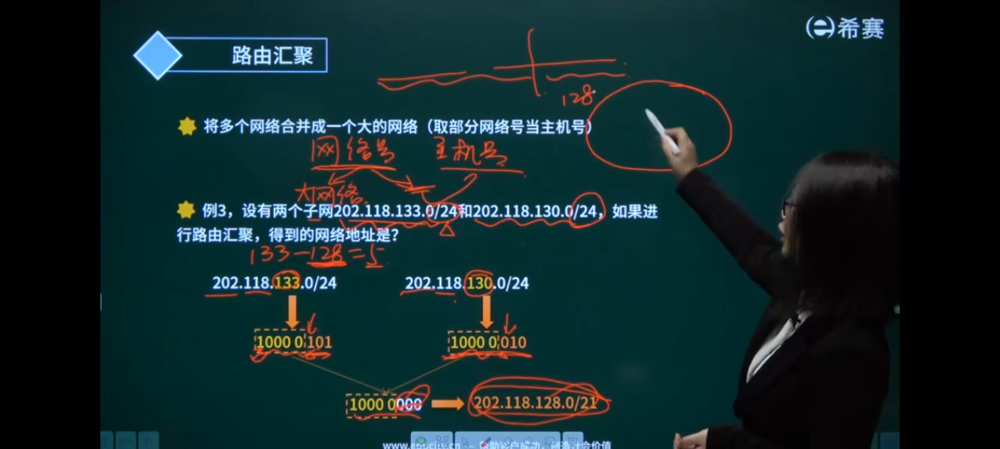



- 子网划分是对内拆小网，解决广播风暴、IP 浪费、部门隔离的本地管理问题；
- 路由汇聚是对外并大网，解决子网多导致的路由表臃肿、转发慢、维护繁的全网效率问题。

### IP地址/n

~~~
前19位为网络地址
192.168.1.188/16
~~~

### 子网掩码

- 
- 
- 

~~~
255.255.0.0
11111111.11111111.00000000.00000000
~~~

### 子网划分

- 取部分主机号当子网号
- 例题1

~~~
11111111.11111111.00000000.00000000
~~~

- 要划分27个子网
- 那至少需要32 2的5次方

~~~
11111111.11111111.11111000.00000000
255.255.248.0
~~~

- 例题2

~~~
168.195.0.0
10101000.11000011.00000000.00000000

11111111.11111111.11111100.00000000
255.255.252.0
~~~

- 要700台主机，那一个子网至少需要1024台主机2的10次方

### 路由汇聚

- 取部分网络号当主机号
- 
- 

