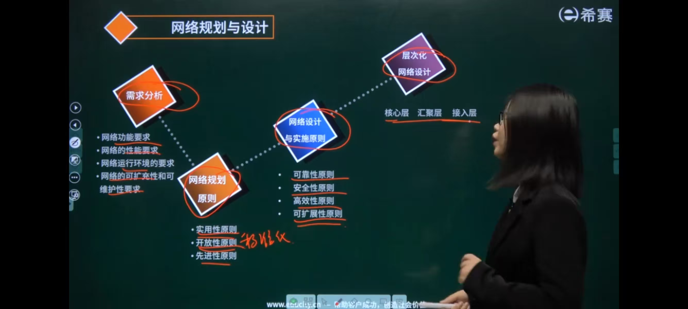
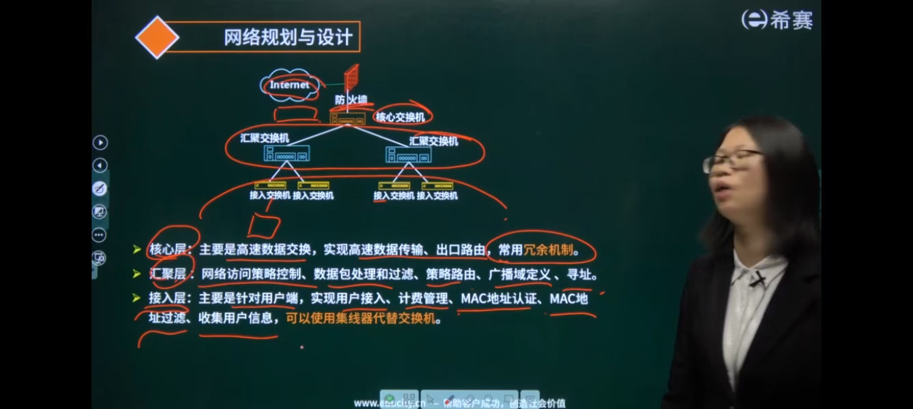
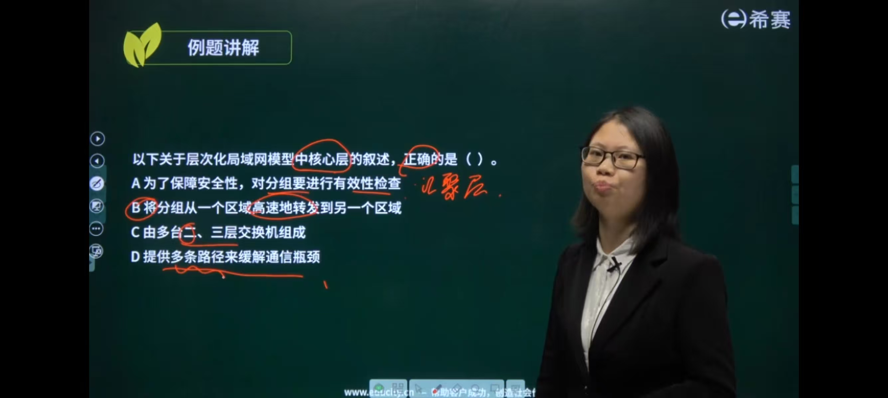



- 
- 
- 

### 设计流程

#### 1. 需求分析

- 网络功能要求
- 网络的性能要求
- 网络运行环境的要求
- 网络的可扩充性和可维护性要求

#### 2. 网络规划原则

- 实用性原则
    - 需要10G，给1024G就太多了
- 开放性原则
    - 标准化
- 先进性原则
    - 需要10G，给16G

#### 3. 网络设计与实施原则

- 可靠性原则
- 安全性原则
- 高效性原则
- 可扩展性原则

#### 4. 层次化网络设计

- 核心层
- 汇聚层
- 接入层

### 三层结构

~~~
Internet
防火墙 
--- 核心交换机
--- 汇聚交换机1 汇聚交换机2
--- 终端交换机1.1 终端交换机1.2 终端交换机2.1 终端交换机2.2
~~~

- 员工电脑（接入层）→ 本区域汇聚层（审核过滤）→ 核心层（高速转发）→ 外网 / 其他网段；

#### 核心层

- 主要是高速数据交换
- 实现高速数据传输，出口路由，常用冗余机制

#### 汇聚层

- 网络访问策略控制
- 数据包处理和过滤
- 策略路由
- 广播域定义
- 寻址

#### 接入层

- 主要针对用户端
- 实现，用户接入，计费管理，MAC地址认证，MAC地址过滤，手机用户信息
    - 可以使用集线器代替交换机

### 例题

