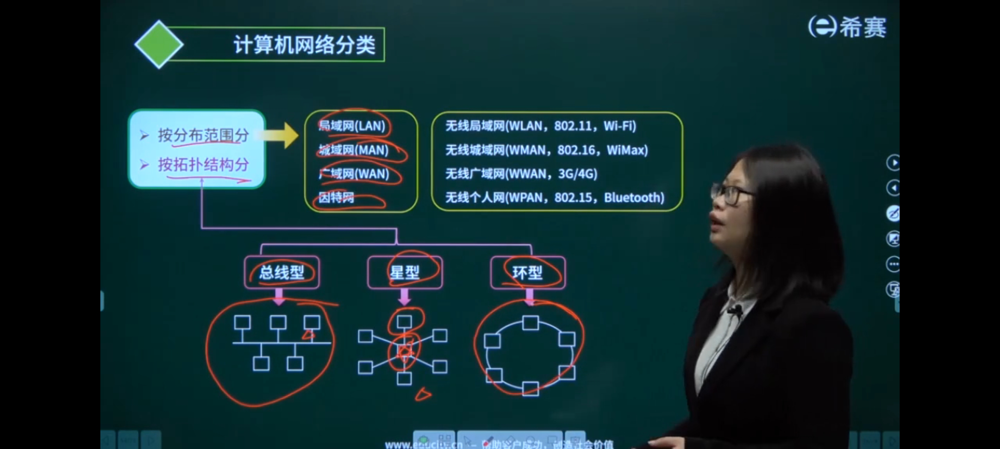
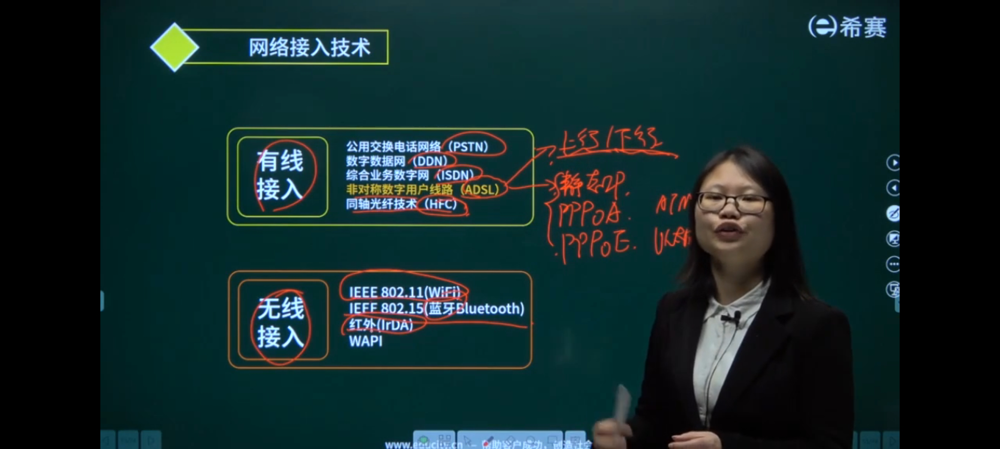
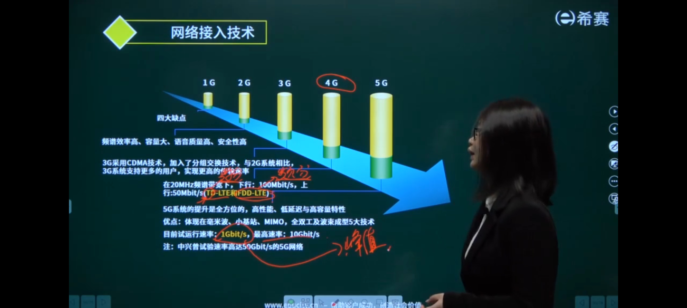
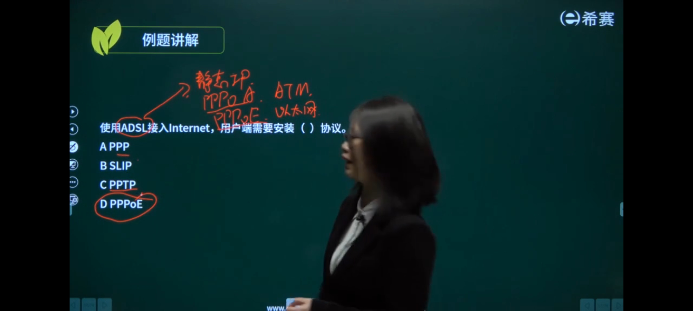
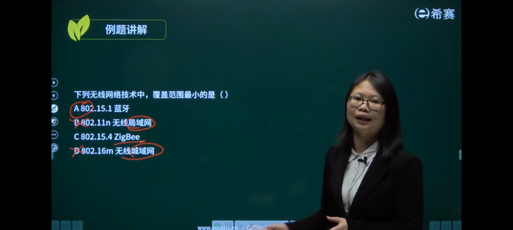



### ADSL

- 静态IP,
- PPPOA
    - (PPP+ATM 结合)
- PPPOE (PPP+Ethernet结合)
    - (PPP+以太网 结合)

- PPP (Point to Point Protocol) 点对点协议
- ATM (Asynchronous Transfer Mode) 异步传输模式
- Ethernet (以太网)
- PPTP (Point to Point Tunneling Protocol) 点对点隧道协议

### 截图

- 
- 
- 
- 
- 

