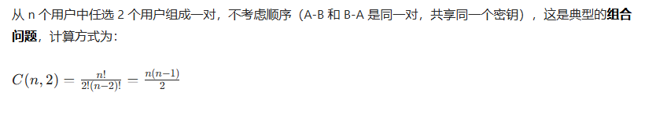



- 加密和解密使用同一把密钥

### 一、核心定义与原理

- 定义：通信双方共享同一把密钥，发送方用该密钥加密明文，接收方用相同密钥解密密文，实现数据保密。
- 核心逻辑：密钥协商：通信双方预先通过安全渠道共享密钥（如线下传递、加密信道分发）。
- 关键特性：加密算法是公开的，安全性完全依赖密钥的保密性，而非算法本身。

### 二、核心特点

| 特性         | 详细说明                                                                                                          |
| ------------ | ----------------------------------------------------------------------------------------------------------------- |
| 单密钥特性   | 加密密钥 = 解密密钥，双方需预先共享，密钥数量少（2 个用户仅需 1 个密钥）。                                        |
| 高性能       | 算法逻辑简单，计算效率极高，加密解密速度比非对称加密快 1-2 个数量级，适合大数据量加密（如文件、视频、实时通信）。 |
| 硬件友好     | 算法可通过硬件加速（如 CPU 指令集 AES-NI），进一步提升处理速度，广泛用于路由器、服务器等设备。                    |
| 密钥管理难题 | 多用户场景下密钥量呈几何级增长：n 个用户需要 n(n-1)/2 个密钥，管理和分发成本极高，一旦密钥泄露，整个通信被破解。  |
| 无不可否认性 | 双方共享同一密钥，无法证明消息是某一方发送的，存在抵赖风险。                                                      |

### 三、典型算法

#### 3.1 DES（数据加密标准）

- 密钥长度：56 位（实际存储 64 位，8 位为校验位）。
- 特点：1977 年成为标准，算法公开，目前已被暴力破解，安全性极低。
- 应用：仅用于兼容旧系统，现代场景已淘汰。

#### 3.2 3DES（三重 DES）

- 密钥长度：112 位（2 个 56 位密钥）或 168 位（3 个 56 位密钥）。
- 特点：通过三次 DES 加密（加密 - 解密 - 加密）提升安全性，是 DES 的过渡方案。
- 应用：在 AES 普及前用于金融、通信等领域，目前逐步被 AES 替代。

#### 3.3 AES（高级加密标准）

- 密钥长度：128 位、192 位、256 位，软考重点考查 128 位密钥。
- 特点：安全性极高，无有效破解方法，效率优于 3DES，是目前主流首选算法。
- 应用：HTTPS 数据传输、磁盘加密（BitLocker）、VPN 通信、数据库加密等。
- todo

#### 3.4 RC4（流加密算法）

- 特点：流加密算法，生成伪随机密钥流与明文逐位异或，速度极快。
- 应用：早期 Wi-Fi 加密（WEP）、浏览器 SSL 加密，因存在安全漏洞，现代场景已限制使用。

### 四、密钥管理的核心问题

- 密钥分发：双方需安全传递密钥，若通过网络分发，需依赖非对称加密等安全渠道，否则易被拦截。
- 密钥存储：密钥需妥善存储（如硬件安全模块 HSM），若存储设备被攻破，密钥泄露会导致所有加密数据失效。
- 密钥更新：长期使用同一密钥会增加泄露风险，需定期更新密钥，但更新过程需重新安全分发，成本较高。

### 五、典型应用场景

- 数据存储加密：磁盘加密（如 Windows BitLocker）、数据库字段加密，保护静态数据安全。
- 实时通信加密：VPN、VoIP 语音通话、视频会议，加密传输中的实时数据。
- 文件传输加密：大文件传输（如备份文件、软件安装包），利用其高性能实现快速加密。
- 消息认证码（MAC）：结合哈希函数生成消息认证码，验证数据完整性和合法性（如 HMAC）。
  - todo 

### 六、总结

- 算法分类：AES、3DES 属于对称加密，是软考必考算法。
- 特性对比：对称加密的核心优势是速度快，劣势是密钥管理难。
- 应用场景：大数据量加密场景优先选对称加密（如文件、通信）。
- 安全风险：密钥泄露是最大风险，需结合非对称加密解决密钥分发问题。

### 补充

- 计算逻辑
- 

