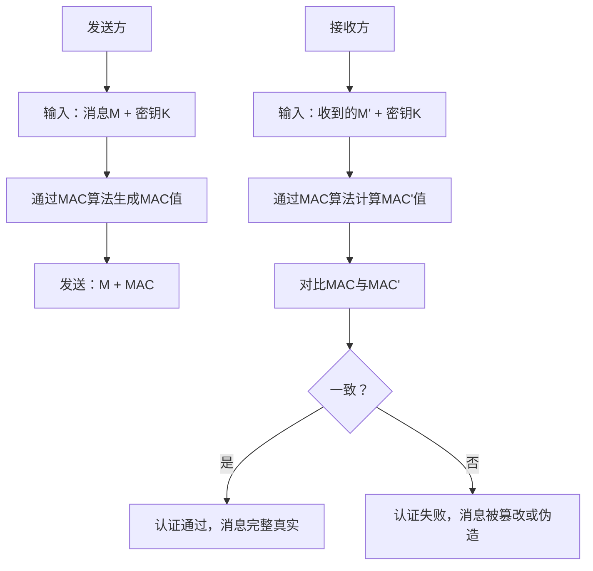

[TOC]

### 1. 消息认证

- 消息认证（Message Authentication） 是验证消息完整性和真实性的安全机制，确保接收方收到的消息是由合法发送方发送，且在传输过程中未被篡改、伪造或重放。

### 2. 目标

| 目标       | 具体含义                                                     |
| ---------- | ------------------------------------------------------------ |
| 完整性     | 确保消息内容在传输或存储过程中未被偶然或恶意修改、插入、删除 |
| 真实性     | 验证消息确实来自声称的发送方，而非伪造                       |
| 不可否认性 | 不可否认性                                                   |
| 新鲜性     | 新鲜性                                                       |

### 3. 息认证的主要技术分类

#### 3.1 基于对称密码的消息认证

- 基本原理
  - 发送方和接收方共享对称密钥，利用对称加密算法对消息进行处理，实现认证。
- 两种实现方式
  - 发送方和接收方共享对称密钥，利用对称加密算法对消息进行处理，实现认证。
    - 优点：同时提供保密性和认证
    - 缺点：加密开销大，无法提供不可否认性
  - 消息认证码（MAC）：发送方将消息和密钥输入 MAC 算法，生成固定长度的 MAC 值，与消息一起发送。接收方用相同密钥和算法计算 MAC，对比是否一致。
  - 典型算法：HMAC（基于哈希的 MAC）、CMAC（基于分组密码的 MAC）

#### 3.2 基于哈希函数的消息认证

- 基本原理
  - 利用哈希函数（如 SHA-256）的单向性和抗碰撞性，生成消息的哈希值（摘要），通过验证摘要实现认证。
- 两种实现方式
  - 简单哈希认证：发送方计算消息哈希值，与消息一起发送。接收方重新计算哈希值并对比。
    - 缺点：易被篡改（攻击者可同时修改消息和哈希值）
  - 带密钥的哈希认证（HMAC）：结合密钥和哈希函数，只有持有密钥的一方才能生成正确的哈希值。
    - 核心公式：HMAC(K, M) = H((K ⊕ opad) || H((K ⊕ ipad) || M))
    - 优点：效率高、安全性强，是目前最常用的消息认证方式

#### 3.3 基于公钥密码的消息认证（数字签名）

- 基本原理
  - 发送方用私钥对消息哈希值进行加密，生成数字签名；接收方用发送方公钥解密签名，对比消息哈希值。
- 核心特点
  - 同时提供认证、完整性和不可否认性
  - 开销高于 MAC，但解决了对称密码的密钥分发问题
  - 典型算法：RSA 签名、DSA、ECDSA

### 4. MAC-消息认证码

#### 4.1. MAC 的核心特性

- 真实性：只有持有密钥的一方才能生成有效的 MAC
- 完整性：任何对消息的修改都会导致 MAC 验证失败
- 不可伪造性：无法在不知道密钥的情况下，为任意消息生成有效的 MAC

#### 4.2. 常见 MAC 算法对比

| 算法类型           | 代表算法              | 特点                                 | 应用场景                           |
| ------------------ | --------------------- | ------------------------------------ | ---------------------------------- |
| 基于哈希的 MAC     | HMAC-SHA256、HMAC-MD5 | 效率高、实现简单，安全性依赖哈希函数 | 网络通信（如 IPsec）、API 接口认证 |
| 基于分组密码的 MAC | CMAC、OMAC            | 安全性依赖分组密码，支持并行计算     | 金融交易、高安全性要求场景         |
| 流密码 MAC         | GMAC                  | 基于流密码，处理速度快               | 实时通信、流媒体传输               |

#### 4.3. MAC 的工作流程

### 5. 消息认证与数字签名的区别

| 特性       | 消息认证（MAC）          | 数字签名                       |
| ---------- | ------------------------ | ------------------------------ |
| 核心功能   | 完整性、真实性           | 完整性、真实性、不可否认性     |
| 密钥类型   | 对称密钥（共享）         | 非对称密钥（公钥 + 私钥）      |
| 不可否认性 | 不可否认性               | 支持（私钥唯一属于发送方）     |
| 计算开销   | 低                       | 高                             |
| 应用场景   | 内部系统通信、低成本认证 | 跨组织通信、法律合同、金融交易 |

### 6. 总结

1. 消息认证的核心目标：完整性、真实性、不可否认性（需数字签名）、新鲜性
2. MAC 的定义与特性：基于密钥的消息认证码，提供完整性和真实性
3. HMAC 的核心原理：结合哈希函数和密钥，是软考重点考察内容
4. 消息认证与数字签名的区别：不可否认性、密钥类型是核心考点
5. 常见攻击方式：重放攻击、篡改攻击、伪造攻击，对应防御措施（如时间戳、序列号防重放）

### 7. 名词

| 缩写 | 英文全拼                                 | 中文译名               | 核心定义 | 应用场景 | 软考高频考点 |
| ---- | ---------------------------------------- | ---------------------- | -------- | -------- | ------------ |
| MAC  | Galois Message Authentication Code       | 消息认证码             | ---      | ---      | ---          |
| HMAC | Hash-based Message Authentication Code   | 基于哈希的消息认证码   | ---      | ---      | ---          |
| CMAC | Cipher-based Message Authentication Code | 基于密码的             | ---      | ---      | ---          |
| GMAC | Galois Message Authentication Code       | 流密码（伽罗瓦域运算） | ---      | ---      | ---          |

| 缩写 | 英文全拼     | 中文译名               | 核心定义                                                          |
| ---- | ------------ | ---------------------- | ----------------------------------------------------------------- |
| H    | Hash-based   | 基于哈希的             | 表明该算法的底层实现依赖哈希函数（如 SHA-256、MD5）               |
| C    | Cipher-based | 基于密码的             | 特指基于分组密码算法（如 AES、DES）实现                           |
| G    | Galois       | 流密码（伽罗瓦域运算） | 指算法基于伽罗瓦域（有限域） 数学运算实现，是一种高效的多项式运算 |

