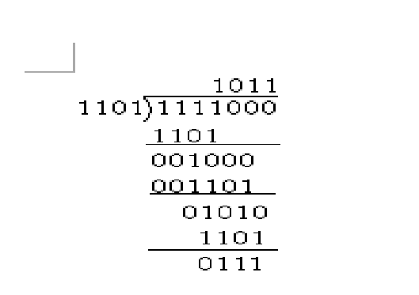

[TOC]

### 1. 模2运算

- 模2运算不考虑进位和借位，
- 两个二进制位相运算的时候，这两个值就能确定出结果，
- 不受前一次运算结果的影响，也不会对下一次造成影响。

### 2. 模2加法

- 规则是：0+0=0；1+1=0；0+1=1；1+0=1；（相同为0.相异为1）
- 例如 1101 + 110 = 1011；

### 3. 模2减法

- 规则是：0-0=0；1-1=0；0-1=1；1-0=1； （相同为0.相异为1）
- 例如：100101 - 110110 = 10011；

### 4. 模2乘法

- 规则是：$ 0*0=0  0*1=0 1*0=0 1*1=1 $；
    - （有0结果0，与普通四则运算里的乘法一样）

~~~
          1 0 0 1
          1 1 0 1
模2 乘法   -------
          1 0 0 1
      1 0 0 1
异或 1 0 0 1
------------------
    1 1 0 0 1 0 1   
~~~

### 5. 模2除法

- 模2除法是模2乘法的逆运算
- 1111000÷1101的运算如下：
- 

1. 当最后余数的位数小于除数位数时，除法停止。
2. 当被除数的位数小于除数位数时，则商数为0，被除数就是余数。
3. 只要**被除数或部分余数的位数与除数一样多**，且最高位为1，不管其他位是什么数，皆可商1。

#### 5.1 txt展示

~~~
          1011
1101 ) 1111000
       1101
       ----
       001000
         1101
         ---
         01010
          1101
          ---
          0111
~~~

