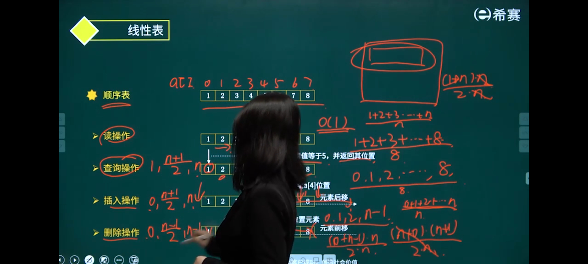
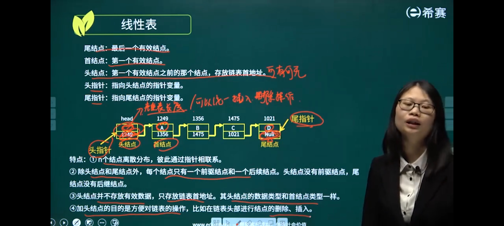
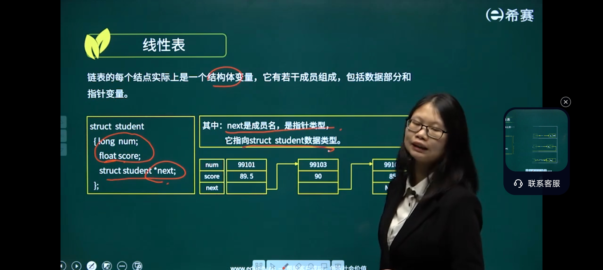
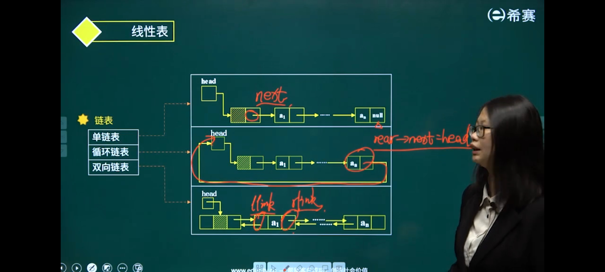
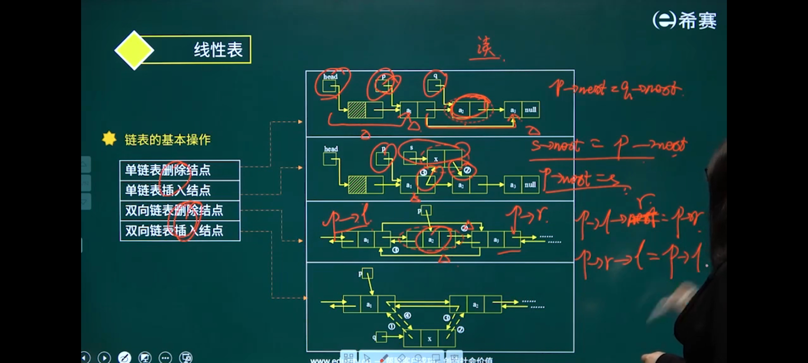
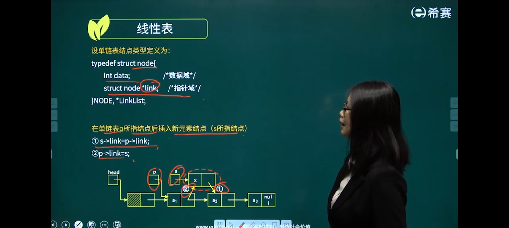
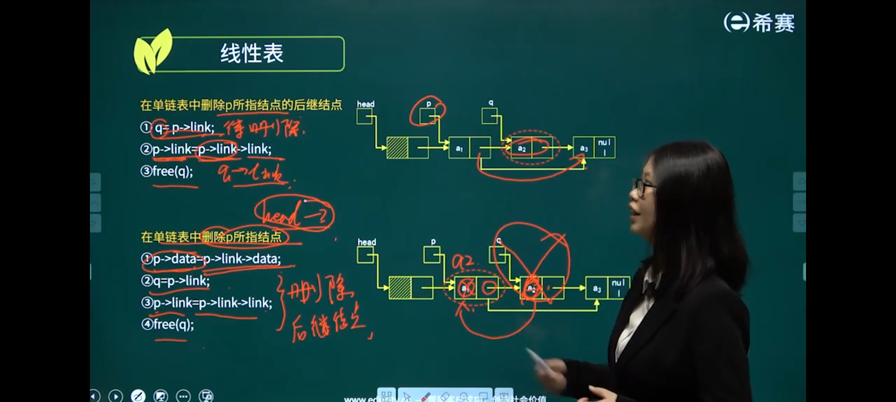
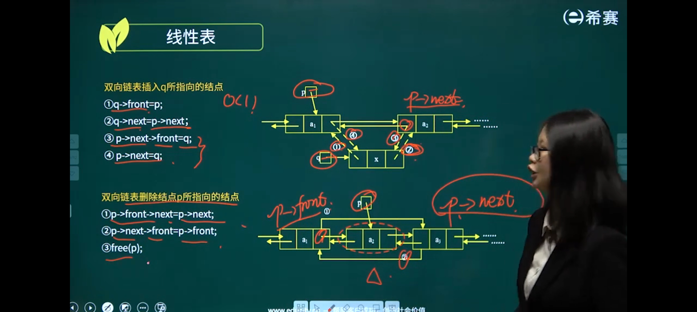
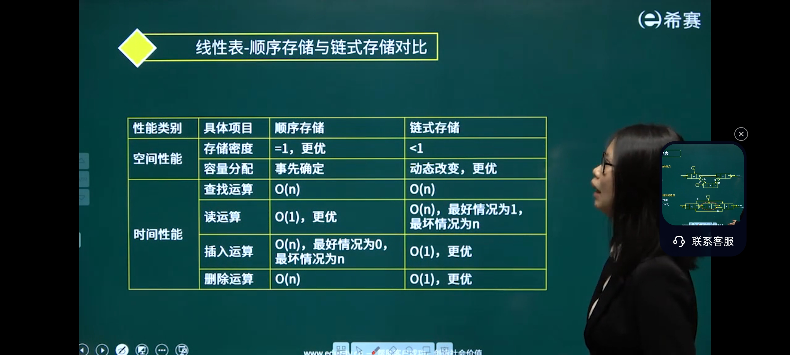
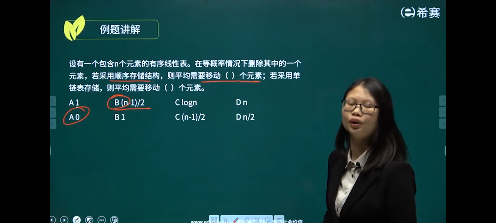



### 线性表crud

- 

### 链表简介

- 队列长度的公式为什么要加size
    - 有负数
- head 和 tail 是两个独立的变量，它们的值（下标数字）都存在队列结构之外的内存里，都不占用队列数组的存储位置。
- 平均移动次数，(0+1+2...+(n-1))/n
- 
- 

### 双向链表

- 

### 链表crud

- crud
- 
- 单
- 
- 
- 双
- 

### 对比

- 

### 例题

- 

