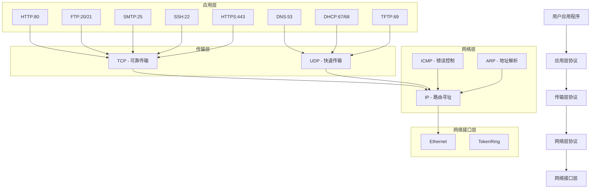

<span  style="font-family: Simsun,serif; font-size: 17px;">

[TOC]

- 
- 

## TCP/IP协议簇分层结构

TCP/IP协议簇采用四层模型，与OSI七层模型对应关系如下：

| TCP/IP层次 | OSI对应层次 | 主要协议 | 端口号 | 功能描述 |
|-----------|------------|---------|--------|----------|
| **应用层** | 应用层+表示层+会话层 | HTTP, FTP, SMTP, POP3, Telnet, DHCP, TFTP, SNMP, DNS, NFS | 见详细列表 | 为应用程序提供网络服务 |
| **传输层** | 传输层 | TCP, UDP | - | 提供端到端的数据传输服务 |
| **网络层** | 网络层 | IP, ICMP, IGMP, ARP, RARP | - | 数据包路由和转发 |
| **网络接口层** | 数据链路层+物理层 | CSMA/CD, TokenRing | - | 物理网络接口和数据帧传输 |

## TCP/IP协议详细说明

### 应用层协议

| 协议 | 全称 | 中文名称 | 端口号 | 传输层协议 | 功能描述 | 应用场景 |
|------|------|---------|--------|----------|----------|----------|
| **HTTP** | HyperText Transfer Protocol | 超文本传输协议 | 80 | TCP | Web内容传输 | Web浏览器访问网页 |
| **HTTPS** | HyperText Transfer Protocol Secure | 安全超文本传输协议 | 443 | TCP | 加密Web内容传输 | 安全Web访问 |
| **FTP** | File Transfer Protocol | 文件传输协议 | 20/21 | TCP | 文件传输服务 | 文件上传下载服务 |
| **SMTP** | Simple Mail Transfer Protocol | 简单邮件传输协议 | 25 | TCP | 邮件发送 | 邮件发送服务 |
| **POP3** | Post Office Protocol version 3 | 邮局协议第3版 | 110 | TCP | 邮件接收 | 邮件接收服务 |
| **IMAP** | Internet Message Access Protocol | 互联网消息访问协议 | 143 | TCP | 邮件访问 | 在线邮件管理 |
| **Telnet** | Terminal Network | 终端网络协议 | 23 | TCP | 远程终端访问 | 远程登录服务 |
| **SSH** | Secure Shell | 安全外壳协议 | 22 | TCP | 加密远程访问 | 安全远程管理 |
| **DHCP** | Dynamic Host Configuration Protocol | 动态主机配置协议 | 67/68 | UDP | 自动网络配置 | 自动分配IP地址 |
| **TFTP** | Trivial File Transfer Protocol | 简单文件传输协议 | 69 | UDP | 简单文件传输 | 网络引导，固件升级 |
| **SNMP** | Simple Network Management Protocol | 简单网络管理协议 | 161 | UDP | 网络设备管理 | 网络监控和管理 |
| **DNS** | Domain Name System | 域名系统 | 53 | UDP/TCP | 域名解析 | 域名与IP地址转换 |
| **NFS** | Network File System | 网络文件系统 | 2049 | TCP/UDP | 网络文件共享 | 远程文件访问 |

#### 协议选择TCP/UDP的原因

**使用TCP的协议特点：**
- 需要可靠传输（如文件传输、网页浏览）
- 数据完整性要求高（如邮件、远程登录）
- 允许较高延迟，但要求零丢包
- 需要连接状态管理

**使用UDP的协议特点：**
- 对实时性要求高（如DNS查询、DHCP）
- 数据量小，重传成本低
- 可以容忍一定的数据丢失
- 无需维护连接状态

**同时支持TCP/UDP的协议：**
- **DNS**: 小查询用UDP(快速)，大响应或区域传输用TCP(可靠)
- **NFS**: v2/v3主要用UDP，v4主要用TCP

#### 应用层协议分类总览

| 传输层协议 | 应用层协议 | 特点说明 |
|-----------|------------|----------|
| **TCP** | HTTP(80), HTTPS(443), FTP(20/21), SMTP(25), POP3(110), IMAP(143), Telnet(23), SSH(22) | 可靠传输，适用于数据完整性要求高的应用 |
| **UDP** | DHCP(67/68), TFTP(69), SNMP(161) | 快速传输，适用于实时性要求高或数据量小的应用 |
| **TCP/UDP** | DNS(53), NFS(2049) | 根据具体需求选择传输协议 |

### 传输层协议

| 协议 | 全称 | 中文名称 | 特性 | 适用场景 | 主要功能 |
|------|------|---------|------|----------|----------|
| **TCP** | Transmission Control Protocol | 传输控制协议 | 面向连接，可靠传输 | 文件传输、网页浏览、邮件 | 提供可靠的字节流服务 |
| **UDP** | User Datagram Protocol | 用户数据报协议 | 无连接，快速传输 | 视频流、DNS查询、游戏 | 提供简单的数据报服务 |

### 网络层协议

| 协议 | 全称 | 中文名称 | 功能描述 | 主要作用 |
|------|------|---------|----------|----------|
| **IP** | Internet Protocol | 网际协议 | 数据包路由和寻址 | 提供无连接的数据包传输 |
| **IPv4** | Internet Protocol version 4 | 网际协议第4版 | 32位地址空间 | 传统互联网地址协议 |
| **IPv6** | Internet Protocol version 6 | 网际协议第6版 | 128位地址空间 | 下一代互联网地址协议 |
| **ICMP** | Internet Control Message Protocol | 网际控制消息协议 | 错误报告和网络诊断 | 网络故障检测和报告 |
| **IGMP** | Internet Group Management Protocol | 网际组管理协议 | 多播组成员管理 | 管理IP多播组成员关系 |
| **ARP** | Address Resolution Protocol | 地址解析协议 | IP地址转换为MAC地址 | 本地网络地址映射 |
| **RARP** | Reverse Address Resolution Protocol | 反向地址解析协议 | MAC地址转换为IP地址 | 无盘工作站地址获取 |

### 网络接口层协议

| 协议 | 全称 | 中文名称 | 技术类型 | 应用场景 |
|------|------|---------|----------|----------|
| **CSMA/CD** | Carrier Sense Multiple Access with Collision Detection | 载波侦听多址接入/冲突检测 | 以太网访问控制 | 有线以太网 |
| **CSMA/CA** | Carrier Sense Multiple Access with Collision Avoidance | 载波侦听多址接入/冲突避免 | 无线网访问控制 | 无线局域网(WiFi) |
| **Token Ring** | Token Ring | 令牌环 | 令牌传递访问控制 | 令牌环网络 |
| **Ethernet** | Ethernet | 以太网 | 帧格式和传输标准 | 局域网连接 |
| **PPP** | Point-to-Point Protocol | 点对点协议 | 串行链路协议 | 拨号上网，专线连接 |

## 协议关联关系流程图



## 端口分类

### 公共端口 (0-1023)
- **特权端口**：需要管理员权限才能绑定
- **标准服务**：由IANA (Internet Assigned Numbers Authority) 统一分配
- **常用端口**：
  - 20/21: FTP
  - 22: SSH
  - 143: IMAP
  - 23: Telnet
  - 25: SMTP
  - 53: DNS
  - 67/68: DHCP
  - 69: TFTP
  - 80: HTTP
  - 110: POP3
  - 161: SNMP
  - 443: HTTPS

### 注册端口 (1024-49151)
- **半特权端口**：一般用户可以使用
- **需要注册**：向IANA申请注册使用
- **应用程序端口**：大多数应用程序使用此范围

### 动态/私有端口 (49152-65535)
- **临时端口**：客户端随机选择使用
- **无需注册**：可自由使用
- **会话端口**：通常用于客户端连接

## 协议工作流程示例

### HTTP访问网页流程
```
1. DNS解析 (UDP:53)
   用户输入域名 → DNS服务器 → 返回IP地址

2. TCP连接建立 (TCP:80)
   客户端 → 三次握手 → Web服务器

3. HTTP请求/响应
   GET请求 → Web服务器处理 → 返回HTML页面

4. TCP连接关闭
   四次挥手释放连接
```

### DHCP获取IP地址流程
```
1. DHCP发现 (UDP:67/68)
   客户端广播 → DHCP服务器

2. DHCP提供
   服务器提供IP地址配置

3. DHCP请求
   客户端确认接受配置

4. DHCP确认
   服务器确认分配完成
```

### ARP地址解析流程
```
1. ARP请求广播
   发送方广播：谁有这个IP地址？

2. ARP响应
   目标主机单播回复：我的MAC地址是...

3. ARP缓存
   双方缓存IP-MAC映射关系
```

## TCP/IP与OSI模型对比

| 特性 | TCP/IP模型 | OSI模型 |
|------|------------|---------|
| **层数** | 4层 | 7层 |
| **发展** | 实践中发展 | 理论先行 |
| **应用** | 广泛应用 | 主要作为参考 |
| **协议** | 具体实现 | 抽象标准 |
| **复杂度** | 相对简单 | 较为复杂 |

**优势：**
- TCP/IP：实用性强，广泛支持，简化实现
- OSI：理论完善，分层清晰，便于教学

**TCP/IP协议簇是互联网的基础**，其简洁实用的四层结构使得全球网络能够高效互联互通。

</span>

 