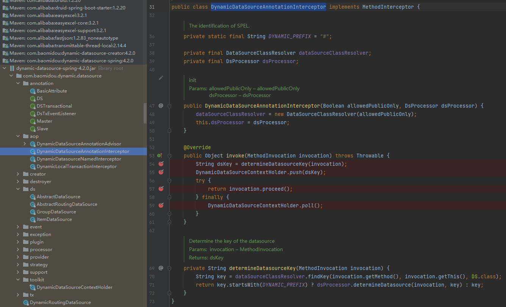
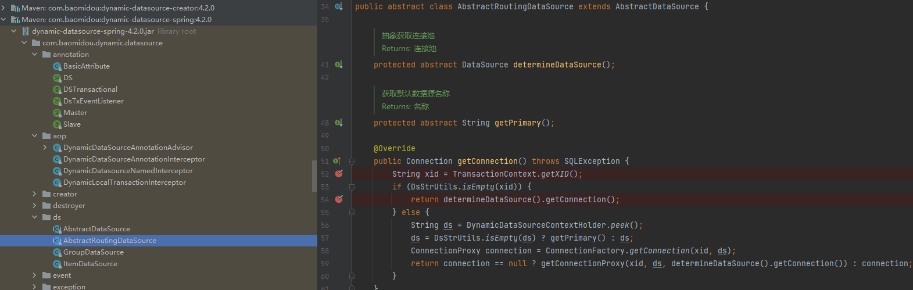
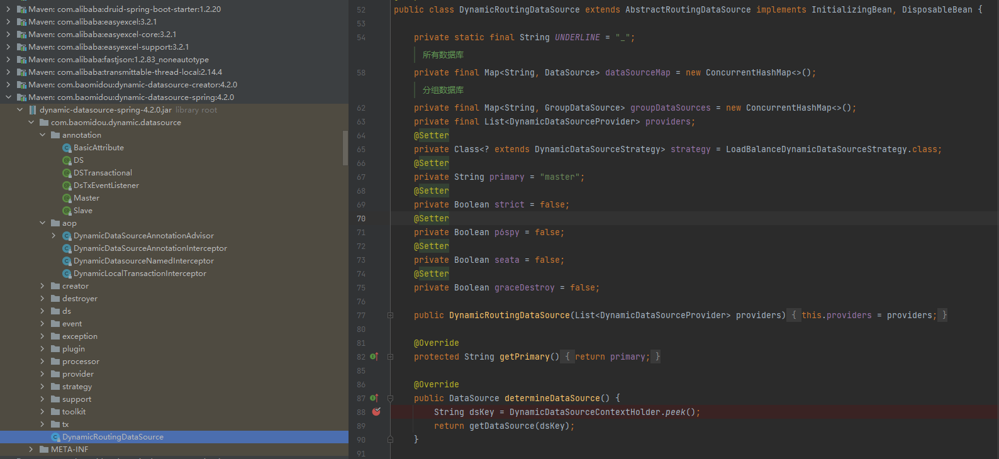
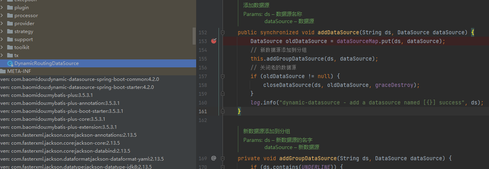

[TOC]

### 切换注解

- 三个
~~~
import com.baomidou.dynamic.datasource.annotation.DS;
import com.baomidou.dynamic.datasource.annotation.Master;
import com.baomidou.dynamic.datasource.annotation.Slave;
~~~

### 参考

- [多数据源分析](https://cloud.tencent.com/developer/article/2276194)

### 代码分析

~~~
-- 1. 获取注解上的数据源
实现这个接口 MethodInterceptor，通过aop切入
com.baomidou.dynamic.datasource.aop.DynamicDataSourceAnnotationInterceptor

-- 2. 数据源解析器
com.baomidou.dynamic.datasource.support.DataSourceClassResolver

-- 3. 基本类型是all dynamicDatasource注解属性
com.baomidou.dynamic.datasource.annotation.BasicAttribute

-- 4. 抽象动态获取数据源
com.baomidou.dynamic.datasource.ds.AbstractRoutingDataSource

-- 5. 核心动态数据源组件
com.baomidou.dynamic.datasource.DynamicRoutingDataSource

-- 6. 核心基于ThreadLocal的切换数据源工具类
com.baomidou.dynamic.datasource.toolkit.DynamicDataSourceContextHolder
~~~

#### 1. DynamicDataSourceAnnotationInterceptor-获取当前数据源并销毁

- 获取当前数据源，切换完然后清除
~~~
// 通过
@Override
public Object invoke(MethodInvocation invocation) throws Throwable {
    // 从方法上的注解，获取数据源从节点名
    String dsKey = determineDatasourceKey(invocation);
    // 将从数据源放入调用链
    DynamicDataSourceContextHolder.push(dsKey);
    try {
        // 执行业务查询
        // 可能会有很多查询
        // 然后进入下一次业务，下一次业务可能是不同的数据源，然后下一次也调用invoke()这个方法,设置下个方法的数据源，用完后，走finally销毁
        // 再返回当前业务，使用当前数据源，走完后销毁
        return invocation.proceed();
    } finally {
        // 删除缓存数据源key
        DynamicDataSourceContextHolder.poll();
    }
}

// 上面
private String determineDatasourceKey(MethodInvocation invocation) {
    //
    String key = dataSourceClassResolver.findKey(invocation.getMethod(), invocation.getThis(), DS.class);
    // 返回当前数据源的key
    return key.startsWith(DYNAMIC_PREFIX) ? dsProcessor.determineDatasource(invocation, key) : key;
}
-- 
~~~
- 

#### 2. DataSourceClassResolver-数据源解析器

- 获取方法上的注解
~~~
// 缓存方法对应的数据源
private final Map<Object, String> dsCache = new ConcurrentHashMap<>();

// 从缓存获取数据
public String findKey(Method method, Object targetObject, Class<? extends Annotation> annotation) {
    if (method.getDeclaringClass() == Object.class) {
        return "";
    }
    // 根据方法和对象确定一个对象
    Object cacheKey = new MethodClassKey(method, targetObject.getClass());
    // 取出当前数据源 value
    String ds = this.dsCache.get(cacheKey);
    if (ds == null) {
        BasicAttribute<String> dsOperation = computeDatasource(method, targetObject, annotation);
        if (dsOperation == null) {
            ds = "";
        } else {
            ds = dsOperation.getDataOperation();
        }
        this.dsCache.put(cacheKey, ds);
    }
    return ds;
}

// 查找注解的顺序 1. 当前方法 2. 桥接方法 3. 当前类开始一直找到Object 4. 支持mybatis-plus, mybatis-spring
private <T> BasicAttribute<T> computeDatasource(Method method, Object targetObject, Class<? extends Annotation> annotation) {
    if (allowedPublicOnly && !Modifier.isPublic(method.getModifiers())) {
        return null;
    }
    //1. 从当前方法接口中获取
    BasicAttribute<T> dsAttr = findDataSourceAttribute(method, annotation);
    if (dsAttr != null) {
        return dsAttr;
    }
}

// 看一个示例 1. 当前方法 从这里设置参数的值
private <T> BasicAttribute<T> findDataSourceAttribute(AnnotatedElement ae, Class<? extends Annotation> annotation) {
    if (annotation.isAssignableFrom(DS.class)) {
        //AnnotatedElementUtils.findMergedAnnotation()会委托给findMergedAnnotationAttributes()
        DS ds = AnnotatedElementUtils.findMergedAnnotation(ae, DS.class);
        if (ds != null) {
            // 在这里设置属性的值
            // T类型，可以根据传入的值判断
            return new BasicAttribute(ds.value());
        }
    } else if (annotation.isAssignableFrom(DSTransactional.class)) {
        DSTransactional dsTransactional = AnnotatedElementUtils.findMergedAnnotation(ae, DSTransactional.class);
        if (dsTransactional != null) {
            TransactionalInfo transactionalInfo = new TransactionalInfo();
            transactionalInfo.setPropagation(dsTransactional.propagation());
            transactionalInfo.setRollbackFor(dsTransactional.rollbackFor());
            transactionalInfo.setNoRollbackFor(dsTransactional.noRollbackFor());
            // 也可以传入对象
            return new BasicAttribute(transactionalInfo);
        }
    }
    return null;
}
~~~

#### 3. BasicAttribute-保存数据源key

~~~
// 基本类型是all dynamicDatasource注解属性
@Data
@AllArgsConstructor
public class BasicAttribute<T> {
    /**
     * dataOperation
     */
    private T dataOperation;
}
~~~

#### 4. AbstractRoutingDataSource-抽象动态获取数据源

~~~
-- 实现类
determineDataSource()的实现类
DynamicRoutingDataSource.determineDataSource()

-- 实现类
getConnection() 实现 javax.sql.DataSource

// 获取jdbc连接
@Override
public Connection getConnection() throws SQLException {
    String xid = TransactionContext.getXID();
    if (DsStrUtils.isEmpty(xid)) {
        return determineDataSource().getConnection();
    } else {
        String ds = DynamicDataSourceContextHolder.peek();
        ds = DsStrUtils.isEmpty(ds) ? getPrimary() : ds;
        ConnectionProxy connection = ConnectionFactory.getConnection(xid, ds);
        return connection == null ? getConnectionProxy(xid, ds, determineDataSource().getConnection()) : connection;
    }
}
~~~
- 

#### 5. DynamicRoutingDataSource-核心动态数据源组件

~~~
private String primary = "master";

// 获取当前线程的数据源
@Override
public DataSource determineDataSource() {
    // 取出之前设置的数据源
    String dsKey = DynamicDataSourceContextHolder.peek();
    return getDataSource(dsKey);
}

// 从 else if (dataSourceMap.containsKey(ds)) 获取数据源
// 设置数据源的方法 addDataSource( ，在下面
public DataSource getDataSource(String ds) {
    if (DsStrUtils.isEmpty(ds)) {
        return determinePrimaryDataSource();
    } else if (!groupDataSources.isEmpty() && groupDataSources.containsKey(ds)) {
        log.debug("dynamic-datasource switch to the datasource named [{}]", ds);
        return groupDataSources.get(ds).determineDataSource();
    } else if (dataSourceMap.containsKey(ds)) {
        log.debug("dynamic-datasource switch to the datasource named [{}]", ds);
        return dataSourceMap.get(ds);
    }
    if (strict) {
        throw new CannotFindDataSourceException("dynamic-datasource could not find a datasource named " + ds);
    }
    return determinePrimaryDataSource();
}

// 新增数据源到map
// 再上层就没看了，应该是从配置文件读取，然后设置数据源
public synchronized void addDataSource(String ds, DataSource dataSource) {
}
~~~
- 
- 

##### 5.1 测试方法

~~~
// 在代码里面新增
try (Connection connection = DataSourceUtils.getConnection(dataSource)) {
    DatabaseMetaData metaData = connection.getMetaData();
    System.out.println("Database Product Name: " + metaData.getDatabaseProductName());
    System.out.println("metaData.getURL(): " + metaData.getURL());
    System.out.println("Database Product Version: " + metaData.getDatabaseProductVersion());
    System.out.println("Driver Name: " + metaData.getDriverName());
    System.out.println("Driver Version: " + metaData.getDriverVersion());
} catch (SQLException e) {
    System.err.println("Error while retrieving database info: " + e.getMessage());
}
~~~

#### 6. DynamicDataSourceContextHolder-数据源切换工具类

- 在线程中存放数据源k(master, slave, userDefine)
- 根据数据源的key去选择使用哪个数据源了

