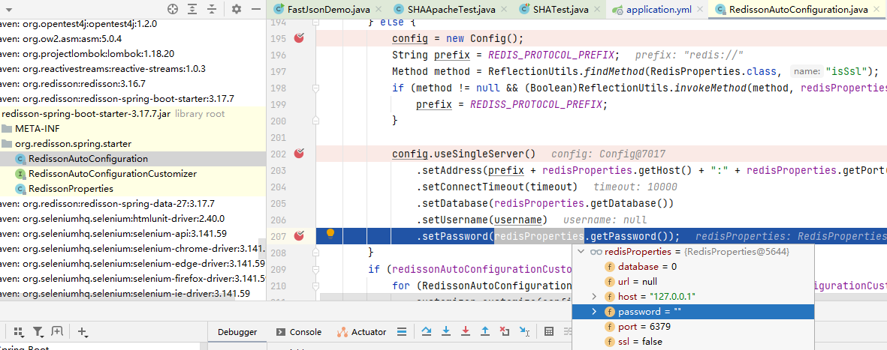

### password

~~~yaml
spring:
  redis:
    password:
    host: 127.0.0.1
    port: 6379
    database: 0
~~~

- password 可以不写，不能为空，否则会被解析为空字符串
- [springboot集成redisson(starter)单机模式启动报错(password)](https://blog.csdn.net/Achinliu/article/details/107940158)
- 
- 配置文件 password 为空解析为空字符串

