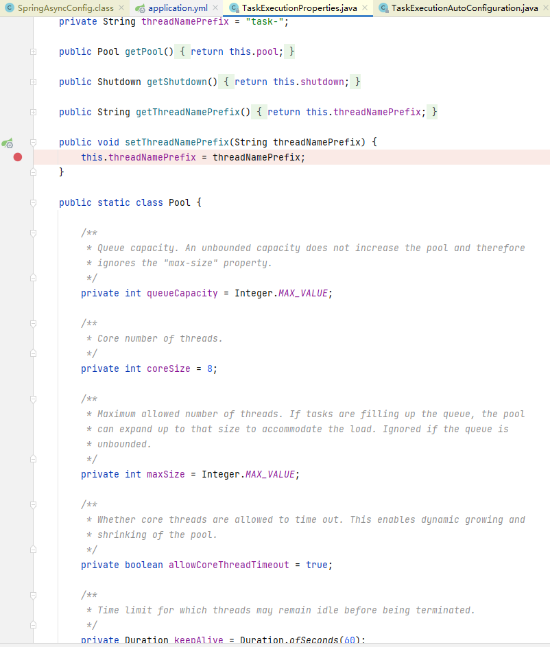
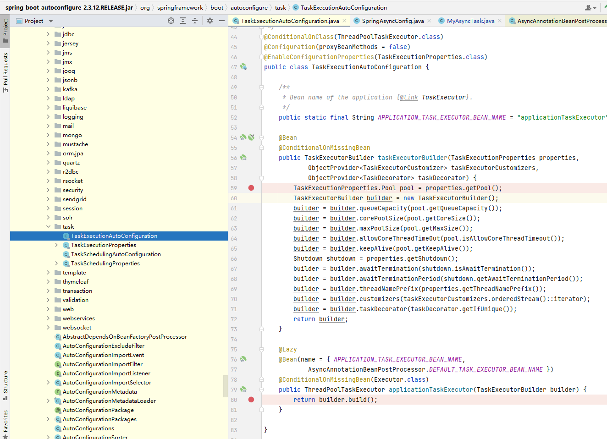
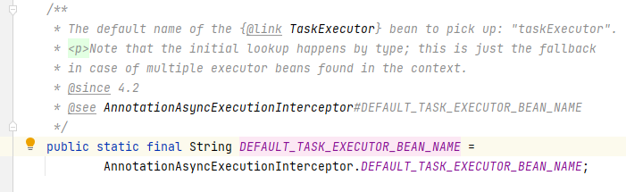
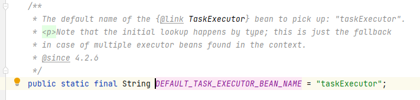

### spring默认

~~~yaml
spring:
  task:
    execution:
      pool:
        max-size: 18
        core-size: 6
        keep-alive: 30s
        queue-capacity: 1000
        allow-core-thread-timeout: true
      thread-name-prefix: aa-thread-
~~~

- 
- 
- 
- 
    - 要拾取的{@link TaskExecutor} bean的默认名称：“ TaskExecutor ”。
    - 注意，初始查找是按类型进行的；这只是在上下文中发现多个执行器bean的情况下的回退。
- **如果用户没有自己配置就会加载，如果配置了就会触发**
    - @ConditionalOnMissingBean(Executor.class)
    - 无法加载，只会加载用户自己写的

### 单个线程池

- @Async("beanName"),name写不写都可以
- 会自动使用

### 多个线程池

- 必须指定bean名
- @Async("beanName")
- 否则报错
    - More than one TaskExecutor bean found within the context, and none is named 'taskExecutor'.
    - Mark one of them as primary or name it 'taskExecutor' (possibly as an alias) in order to use it for async
      processing: [AsyncTaskExecutor1, AsyncTaskExecutor2]

### 问题

- [ ] 为什么anm的@Async 不写name，线程名有问题

