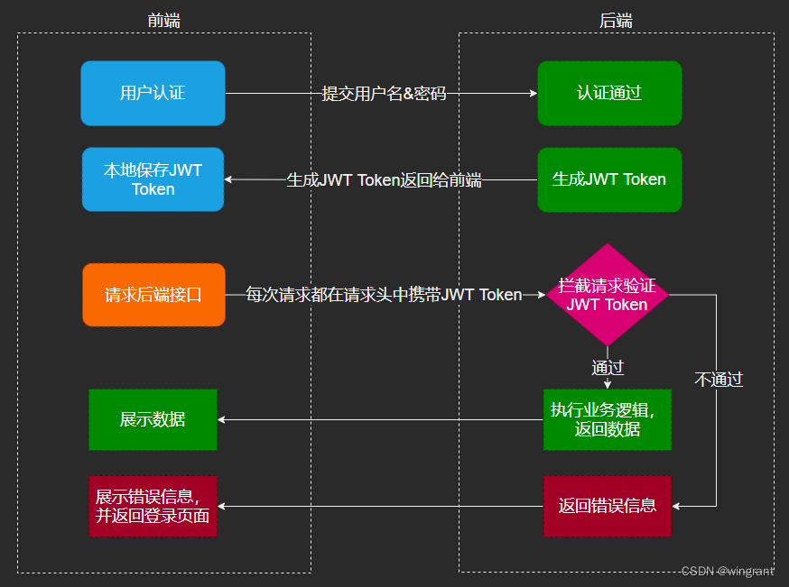

[TOC]

- [参考](https://blog.csdn.net/wingrant/article/details/126445880)

### 一. jwt简介

- JWT(Json Web Token)是一种可以跨域的认证方案。

#### 构成

1. 头部Header：头部包含了两部分，token 类型和采用的加密算法（可为none，后端应限制加密算法，不以这里为准）。
2. 载荷Payload：这部分才是重要的，可以自定义信息保存在此。
3. 签名Signature：使用编码后的header和payload以及我们提供的一个密钥，然后使用header中指定的签名算法进行签名，签名的作用是保证JWT没有被篡改过，如果有人对头部以及负载的内容解码之后进行修改，再进行编码，最后加上之前的签名组合形成新的JWT的话，那么服务器端会判断出新的头部和负载形成的签名和JWT附带上的签名是不一样的。如果要对新的头部和负载进行签名，在不知道服务器加密时用的密钥的话，得出来的签名也是不一样的。

- 这三部分均用base64进行编码，并使用 . 进行分隔。一个典型的 JWT 格式的 token 类似xxxxx.yyyyy.zzzzz。
- JWT对三个部分都使用的是Base64进行编码，但是Base64是可逆的，所以注意在Payload部分不要携带敏感信息。

#### 特点

- 简洁(Compact) : 可以通过URL，POST参数或者在HTTP header发送，因为数据量小，传输速度也很快。
- 自包含(Self-contained) ：负载中包含了所有用户所需要的信息，避免了多次查询数据库。

#### 核心优势：无状态

- 省事，解析完token把信息放在处理链路的上下文，不用去redis或者database去取了。
- 省时，用每个请求验证token慢一点点的代价，换来不用去存储取的优势。

### 二. 优缺点

#### 优点

- 因为json的通用性，JWT是可以跨语言支持的，像JAVA,JavaScript,NodeJS,PHP等语言都能使用。
- 因为有了payload部分，所以JWT可以在自身存储一些其他业务逻辑所必要的非敏感信息。
- 便于传输。JWT的构成非常简单，字节占用很小，所以它是非常便于传输的。
- 它不需要在服务端保存会话信息, 所以它易于应用的扩展。

#### 缺点

- 占带宽： 正常情况下要比 session_id 更大，需要消耗更多流量，挤占更多带宽，假如你的网站每月有 10 万次的浏览器，就意味着要多开销几十兆的流量。听起来并不多，但日积月累也是不小一笔开销。实际上，许多人会在 JWT 中存储的信息会更多。
- 无法在服务端注销。用户主动注销时一般会让前端清理token，后端不理会，很难解决劫持问题。其他解决办法都是有状态的，例如通过Redis存储token副本、Redis存储token版本号、Redis存储过期时间等。
- 性能问题： JWT 的卖点之一就是加密签名，由于这个特性，接收方得以验证 JWT 是否有效且被信任。但是大多数 Web 身份认证应用中，JWT 都会被存储到 Cookie 中，这就是说你有了两个层面的签名。听着似乎很牛逼，但是没有任何优势，为此，你需要花费两倍的 CPU 开销来验证签名。对于有着严格性能要求的 Web 应用，这并不理想，尤其对于单线程环境。

#### 安全建议

- 保证密钥的保密性
- 签名算法固定在后端，不以JWT里的算法为标准
- 避免敏感信息保存在JWT中
- 尽量让JWT的有效时间足够短

### 三. 使用流程

- 首先，前端通过Web表单将自己的用户名和密码发送到后端的接口。这一过程一般是一个HTTP POST请求。建议的方式是通过SSL加密的传输(https协议)，从而避免敏感信息被嗅探。
- 后端核对用户名和密码成功后，将用户的id等其他信息作为 JWT-Payload（负载)，将其与头部分别进行Base64编码拼接后签名形成一个JWT。形成的JWT就是一个形同111.zzz.xxx的字符串。
- 后端将JWT字符串作为登录成功的返回结果返回给前端。前端可以将返回的结果保存在localStorage或sessionStorage上，退出登录时前端删除保存的JWT即可。
- 前端在每次请求时将JWT放入HTTP Header中的Authorization位。(解决XSS和XSRF问题)
- 后端检查是否存在，如存在验证JWT的有效性。例如，检查签名是否正确；检查Token是否过期；检查Token的接收方是否是自己(可选)。
- 验证通过后后端使用JWT中包含的用户信息进行其他逻辑操作，返回相应结果。
- 

### 四. 和session对比

- Session方式存储用户id的最大弊病在于Session是存储在服务器端的，所以需要占用大量服务器内存，对于较大型应用而言可能还要保存许多的状态。
    - 一般而言，大型应用还需要借助一些KV数据库和一系列缓存机制来实现Session的存储。
- 而JWT方式将用户状态分散到了客户端中，可以明显减轻服务端的内存压力。
    - 除了用户id之外，还可以存储其他的和用户相关的信息，例如该用户是否是管理员、用户所在的分组等。
    - 虽说JWT方式让服务器有一些计算压力（例如加密、编码和解码），但是这些压力相比磁盘存储而言可能就不算什么了。
    - 具体是否采用，需要在不同场景下用数据说话。
- Session方式来存储用户id，一开始用户的Session只会存储在一台服务器上。
    - 对于有多个子域名的站点，每个子域名至少会对应一台不同的服务器
- 使用JWT的方式则没有这个问题的存在，因为用户的状态已经被传送到了客户端。

#### 使用Session的缺点

- 占用服务端内存；
- 扩展性差（跨域难解决，不利于分布式）；
- 基于Cookie，容易受到CSRF（跨站请求伪造）攻击。

### 四. 组合使用

- JWT + redis
- JWT 存储少量的信息，uuid
- 将具体的信息存到redis，从redis取出用户权限等信息
- 这样就解决了，jwt token 无法在前端删除撤销的问题

