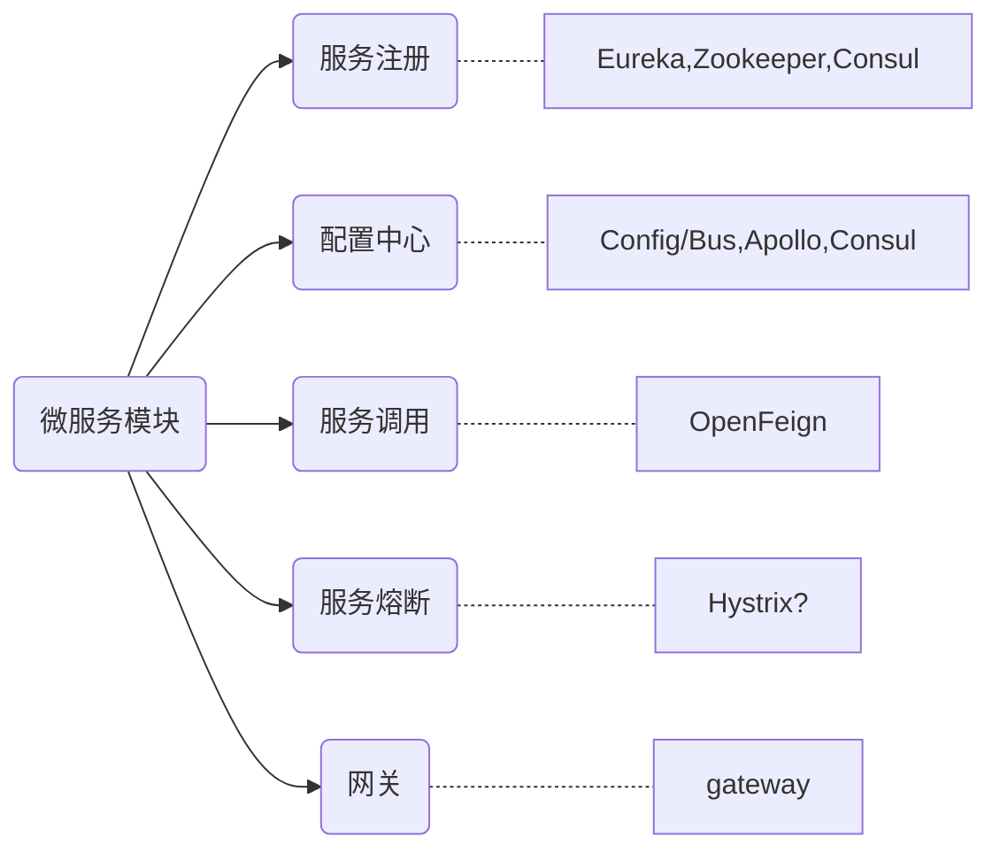

### 基础模块实现

```mermaid
graph LR
A1-1(微服务模块)-->A2-1(服务注册)
A2-1-.-A3-1[Eureka,Zookeeper,Consul]

A1-1(微服务模块)-->A2-2(配置中心)
A2-2-.-A3-2[Config/Bus,Apollo,Consul]

A1-1(微服务模块)-->A2-3(服务调用)
A2-3-.-A3-3[OpenFeign]

A1-1(微服务模块)-->A2-4(服务熔断)
A2-4-.-A3-4[Hystrix?]

A1-1(微服务模块)-->A2-5(网关)
A2-5-.-A3-5[gateway]
```

