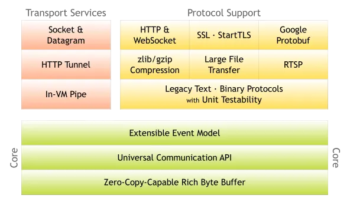

### 架构图

- 
- 上面这张图就是在官网首页的架构图，我们从上到下分析一下。
- 绿色的部分Core核心模块，包括零拷贝、API库、可扩展的事件模型。
- 橙色部分Protocol Support协议支持，包括Http协议、webSocket、SSL(安全套接字协议)、谷歌Protobuf协议、zlib/gzip压缩与解压缩、Large
  File Transfer大文件传输等等。
- 红色的部分Transport Services传输服务，包括Socket、Datagram、Http Tunnel等等。
- 以上可看出Netty的功能、协议、传输方式都比较全，比较强大。

### 目录

#### 入门

- [ ] nio
- [ ] eventloop
- [ ] channel
- [ ] 异步，管道，入栈出栈
- [ ] bytebuf
- [ ] Unpooled

#### 进阶

#### 优化

#### 源码

