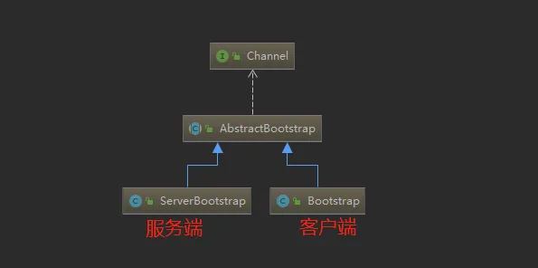
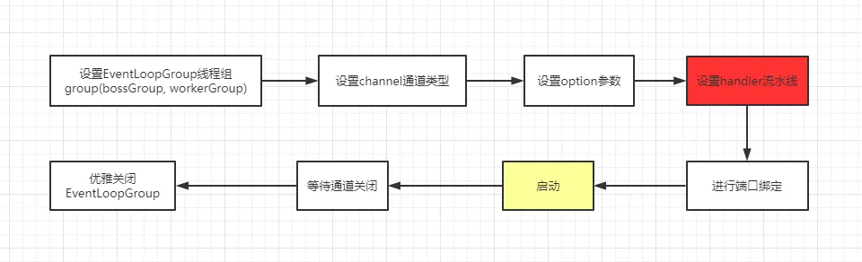
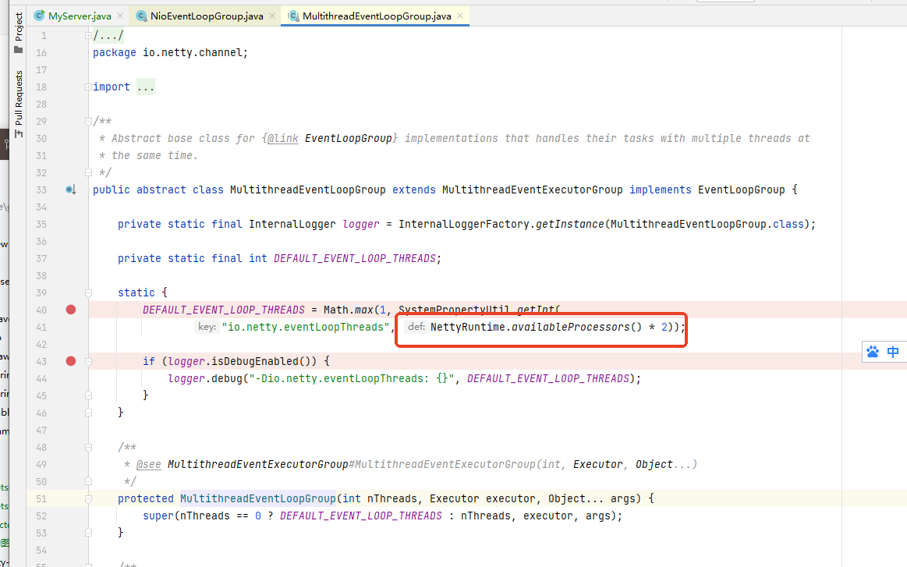

- 特性与重要组件

[TOC]

### 5.1 taskQueue任务队列

### 5.2 scheduleTaskQueue延时任务队列

- 多了一个可延迟一定时间再执行的设置

### 5.3 Future异步机制

- 很多操作都返回这个ChannelFuture对象
- ChannelFuture提供操作完成时一种异步通知的方式。
- 一般在Socket编程中，等待响应结果都是同步阻塞的，而Netty则不会造成阻塞，因为ChannelFuture是采取类似观察者模式的形式进行获取结果。

### 5.4 Bootstrap

- Bootstrap和ServerBootStrap是Netty提供的一个创建客户端和服务端启动器的工厂类，
- 使用这个工厂类非常便利地创建启动类，
- 根据上面的一些例子，其实也看得出来能大大地减少了开发的难度。
- 
- 可以看出都是继承于AbstractBootStrap抽象类，所以大致上的配置方法都相同。
- 一般来说，使用Bootstrap创建启动器的步骤可分为以下几步：
- 

### 5.4.1 group()

- 在上一篇文章《Reactor模式》中，我们就讲过服务端要使用两个线程组：
    - bossGroup 用于监听客户端连接，专门负责与客户端创建连接，并把连接注册到workerGroup的Selector中。
    - workerGroup用于处理每一个连接发生的读写事件。
- 默认线程数
- 
- 通过源码可以看到，默认的线程数是cpu核数的两倍。假设想自定义线程数，可以使用有参构造器

### 5.4.2 channel()

- 这个方法用于设置通道类型，当建立连接后，会根据这个设置创建对应的Channel实例。
- 常见类型
    - NioServerSocketChannel 异步非阻塞的客户端 TCP Socket 连接。
    - NioServerSocketChannel：异步非阻塞的服务器端 TCP Socket 连接。
    - 常用的就是这两个通道类型，因为是异步非阻塞的。所以是首选。
- 非常见
    - 阻塞客户端
    - OioSocketChannel：同步阻塞的客户端 TCP Socket 连接。
    - OioServerSocketChannel：同步阻塞的服务器端 TCP Socket 连接。
- 异步的
    - NioSctpChannel：异步的客户端 Sctp（Stream Control Transmission Protocol，流控制传输协议）连接。
    - NioSctpServerChannel：异步的 Sctp 服务器端连接。

### 5.4.3 option()与childOption()

- option()设置的是服务端用于接收进来的连接，也就是boosGroup线程。
- childOption()是提供给父管道接收到的连接，也就是workerGroup线程。

#### childOption 常用的参数

- SocketChannel参数，也就是childOption()常用的参数：
- SO_RCVBUF Socket参数，TCP数据接收缓冲区大小。
- TCP_NODELAY TCP参数，立即发送数据，默认值为Ture。
- SO_KEEPALIVE Socket参数，连接保活，默认值为False。启用该功能时，TCP会主动探测空闲连接的有效性。

#### option 常用的参数

- ServerSocketChannel参数，也就是option()常用参数：
- SO_BACKLOG Socket参数，服务端接受连接的队列长度，如果队列已满，客户端连接将被拒绝。默认值，Windows为200，其他为128。

### 5.4.4 设置流水线(重点)

- ChannelPipeline是Netty处理请求的责任链，ChannelHandler则是具体处理请求的处理器。实际上每一个channel都有一个处理器的流水线。
- 在Bootstrap中childHandler()方法需要初始化通道，实例化一个ChannelInitializer，这时候需要重写initChannel()
  初始化通道的方法，装配流水线就是在这个地方进行。
- 处理器Handler主要分为两种：
    - ChannelInboundHandlerAdapter(入站处理器)
    - ChannelOutboundHandler(出站处理器)
- 入站指的是数据从底层java NIO Channel到Netty的Channel。
- 出站指的是通过Netty的Channel来操作底层的java NIO Channel。

#### ChannelInboundHandlerAdapter处理器常用的事件有：

1. 注册事件 fireChannelRegistered。
2. 连接建立事件 fireChannelActive。
3. 读事件和读完成事件 fireChannelRead、fireChannelReadComplete。
4. 异常通知事件 fireExceptionCaught。
5. 用户自定义事件 fireUserEventTriggered。
6. Channel 可写状态变化事件 fireChannelWritabilityChanged。
7. 连接关闭事件 fireChannelInactive。

#### ChannelOutboundHandler处理器常用的事件有：

1. 端口绑定 bind。
2. 连接服务端 connect。
3. 写事件 write。
4. 刷新时间 flush。
5. 读事件 read。
6. 主动断开连接 disconnect。
7. 关闭 channel 事件 close。

- 还有一个类似的handler()，主要用于装配parent通道，也就是bossGroup线程。一般情况下，都用不上这个方法。

### 5.4.5 bind()

- 提供用于服务端或者客户端绑定服务器地址和端口号，默认是异步启动。如果加上sync()方法则是同步。

### 5.4.6 优雅地关闭EventLoopGroup

~~~
//释放掉所有的资源，包括创建的线程
bossGroup.shutdownGracefully();
workerGroup.shutdownGracefully();
~~~

- 会关闭所有的child Channel。关闭之后，释放掉底层的资源。

### 5.5 Channel

