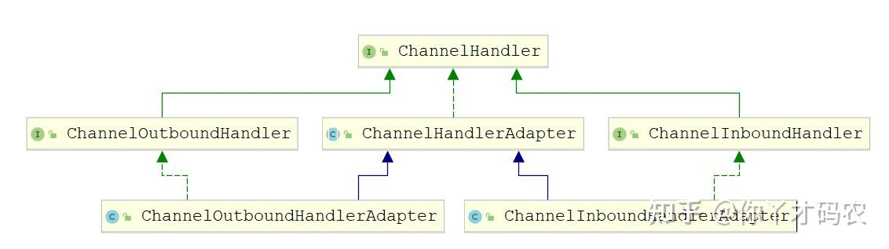

- 特性与重要组件

[TOC]

### ChannelHandler

- 自定义一个Handler类来实现 ChannelHandler接口或者其子类，然后重写相应的业务方法来实现具体的功能。
- 

### 出，入

- ChannelOutboundhandler 服务端写出数据处理
- ChannelInboundHandler 服务端接收数据处理
- ChannerlHandlerAdapter 接收&写出数据处理

### 重写的方法

~~~
public void channelActive(ChannelHandlerContext ctx)，通道就绪事件

public void channelRead(ChannelHandlerContext ctx, Object msg)，通道读取数据事件

public void channelReadComplete(ChannelHandlerContext ctx) ，数据读取完毕事件

public void exceptionCaught(ChannelHandlerContext ctx, Throwable cause)，通道发生异常事件
~~~

