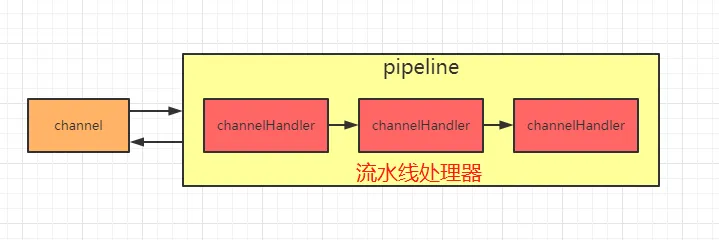
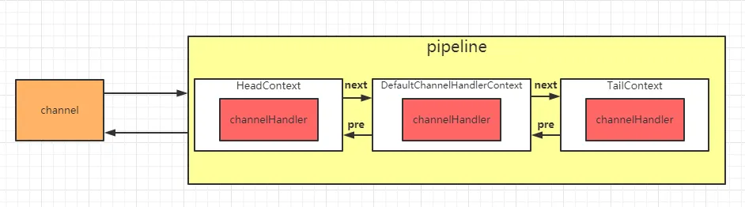
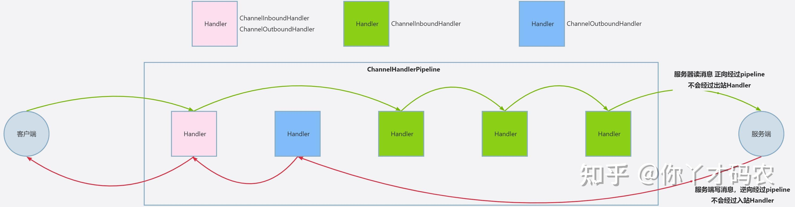

- 监听事件

[TOC]

### 5.7 PiPeline与ChannelPipeline

- 在前面介绍Channel时，我们知道可以在channel中装配ChannelHandler流水线处理器，那一个channel不可能只有一个channelHandler处理器，
    - 肯定是有很多的，既然是很多channelHandler在一个流水线工作，肯定是有顺序的。
- 于是pipeline就出现了，pipeline相当于处理器的容器。初始化channel时，把channelHandler按顺序装在pipeline中，就可以实现按序执行channelHandler了。
- 
- 在一个Channel中，只有一个ChannelPipeline。该pipeline在Channel被创建的时候创建。
- ChannelPipeline包含了一个ChannelHander形成的列表，且所有ChannelHandler都会注册到ChannelPipeline中。

~~~
//ChannelPipeline实现类DefaultChannelPipeline的构造器方法
protected DefaultChannelPipeline(Channel channel) {
 this.channel = ObjectUtil.checkNotNull(channel, "channel");
 succeededFuture = new SucceededChannelFuture(channel, null);
 voidPromise =  new VoidChannelPromise(channel, true);
 //设置头结点head，尾结点tail
 tail = new TailContext(this);
 head = new HeadContext(this);
 
 head.next = tail;
 tail.prev = head;
}
~~~

- 

### 通道流水线

- ChannelPipeline 是一个 Handler 的集合，它负责处理和拦截 inbound 或者 outbound 的事件和操作，相当于一个贯穿 Netty 的责任链.
- 
- 如果客户端和服务器的Handler是一样的，消息从客户端到服务端或者反过来，
    - 每个Inbound类型或Outbound类型的Handler只会经过一次，
    - 混合类型的Handler（实现了Inbound和Outbound的Handler）会经过两次。
- 准确的说ChannelPipeline中是一个ChannelHandlerContext,每个上下文对象中有ChannelHandler。
    - InboundHandler是按照Pipleline的加载顺序的顺序执行, OutboundHandler是按照Pipeline的加载顺序，逆序执行。

