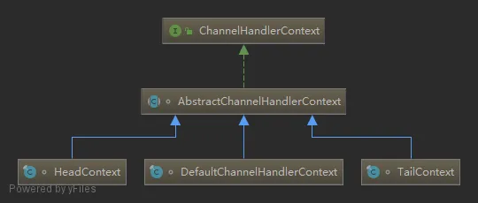

- 监听事件

[TOC]

### 5.8 ChannelHandlerContext

- 在Netty中，Handler处理器是有我们定义的，上面讲过通过集成入站处理器或者出站处理器实现。这时如果我们想在Handler中获取pipeline对象，或者channel对象，怎么获取呢。
- 于是Netty设计了这个ChannelHandlerContext上下文对象，就可以拿到channel、pipeline等对象，就可以进行读写等操作。
- 
- 通过类图，ChannelHandlerContext是一个接口，下面有三个实现类。
- 实际上ChannelHandlerContext在pipeline中是一个链表的形式。看一段源码就明白了：

### 上下文

- 这是事件处理器上下文对象 Pipeline链中的实际处理节点 。
- 每个处理节点ChannelHandlerContext中包含一个 具体的事件处理器 ChannelHandler ,同时ChannelHandlerContext 中也绑定了对应的 ChannelPipeline和Channel
  的信息，方便对ChannelHandler 进行调用。

