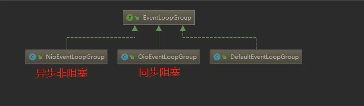

- 事件循环 线程组

[TOC]

### 5.9 EventLoopGroup

- 
- 其中包括了常用的实现类NioEventLoopGroup。OioEventLoopGroup在前面的例子中也有使用过。
- 从Netty的架构图中，可以知道服务器是需要两个线程组进行配合工作的，
    - 而这个线程组的接口就是EventLoopGroup。
- 每个EventLoopGroup里包括一个或多个EventLoop，每个EventLoop中维护一个Selector实例。

