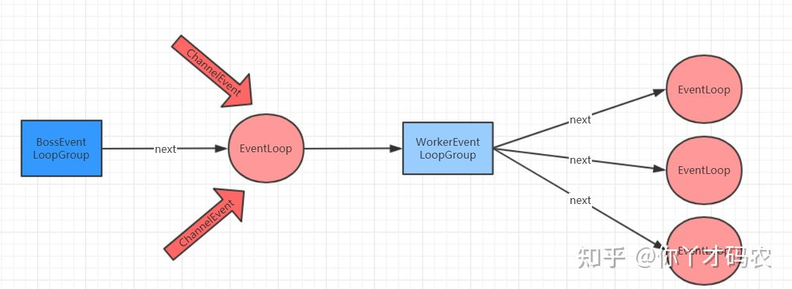

- 事件循环 线程组

[TOC]

### 5.9 EventLoopGroup

- 
- 其中包括了常用的实现类NioEventLoopGroup。OioEventLoopGroup在前面的例子中也有使用过。
- 从Netty的架构图中，可以知道服务器是需要两个线程组进行配合工作的，
    - 而这个线程组的接口就是EventLoopGroup。
- 每个EventLoopGroup里包括一个或多个EventLoop，每个EventLoop中维护一个Selector实例。

### EventLoopGroup和实现类NioEventLoopGroup

- EventLoopGroup 是一组 EventLoop 的抽象，
    - Netty为了更好的利用多核 CPU 资源，一般会有多个EventLoop 同时工作，每个 EventLoop 维护着一个 Selector 实例。
- EventLoopGroup 提供 next 接口，可以从组里面按照一定规则获取其中一个 EventLoop 来处理任务。
- 在 Netty 服务器端编程中，我们一般都需要提供两个 EventLoopGroup。
    - BossEventLoopGroup 和 WorkerEventLoopGroup。
- 通常一个服务端口即一个ServerSocketChannel对应一个Selector 和一个EventLoop线程。
- BossEventLoop 负责接收客户端的连接并将SocketChannel 交给 WorkerEventLoopGroup 来进 行 IO 处理
- 
- BossEventLoopGroup 通常是一个单线程的 EventLoop
    - EventLoop 维护着一个注册了ServerSocketChannel 的 Selector 实例
    - BossEventLoop 不断轮询 Selector 将连接事件分离出来， 通常是 OP_ACCEPT 事件
    - 然后将接收到的 SocketChannel 交给 WorkerEventLoopGroup
    - WorkerEventLoopGroup 会由 next 选择其中一个 EventLoopGroup 来将这个 SocketChannel 注册到其维护的 Selector 并对其后续的 IO 事件进行处理。

~~~
public NioEventLoopGroup()，构造方法,创建线程组

public Future<?> shutdownGracefully()，断开连接，关闭线程
~~~

