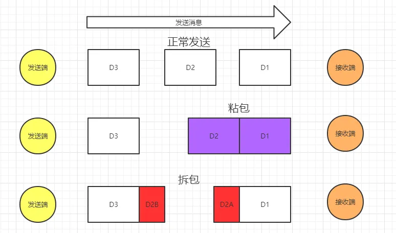
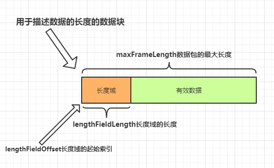

- 粘包和拆包

[TOC]

### 1.1 图解粘包和拆包

- 
- 正常发送消息是三次发送三个数据包，这种情况没有问题。
- 粘包，则是其中有多个数据包合并成一个数据包进行发送，也就是上图的第二种情况。
- 拆包，则是其中一个数据包被拆成了多段，发送的数据包只包含了一个完整数据包的一部分。也就是上图的第三种情况。

### 2. 解决方案

1. 在数据的末尾添加特殊的符号标识数据包的边界。通常会加\n\r、\t或者其他的符号。
2. 在数据的头部声明数据的长度，按长度获取数据。
3. 规定报文的长度，不足则补空位。读取时按规定好的长度来读取。

### 2.1 使用 LineBasedFrameDecoder

- 这是Netty内置的一个解码器，对应的编码器是LineEncoder。
- 原理是上面讲的第一种思路，在数据末尾加上特殊符号以标识边界。默认是使用换行符\n。

### 2.2 使用 FixedLengthFrameDecoder

- 固定长度解码器
- FixedLengthFrameDecoder 的工作原理是将接收到的字节流按照固定长度进行分割。
- 如果接收到的消息字节数等于指定的长度，则认为是一次完整的消息传输。
- 如果接收到的消息字节数小于指定长度，则会缓存消息，等待下次接收到更多数据后再进行拼接。
- 如果接收到的消息字节数大于指定长度，则会截取固定长度的数据，其余数据会放到缓冲区中，等待下次处理

### 2.3 使用 LengthFieldBasedFrameDecoder

- 使用这个解码器解决粘包问题的原理是上面讲的第二种，在数据的头部声明数据的长度，按长度获取数据。
- 这个解码器构造器需要定义5个参数，相对较为复杂一点，先看参数的解释：
- maxFrameLength 发送数据包的最大长度
- lengthFieldOffset 长度域的偏移量。长度域位于整个数据包字节数组中的开始下标。
- lengthFieldLength 长度域的字节数长度。长度域的字节数长度。
- 
- lengthAdjustment 长度域的偏移量矫正。
    - 如果长度域的值，除了包含有效数据域的长度外，还包含了其他域（如长度域自身）长度，那么，就需要进行矫正。
    - 矫正的值为：包长 - 长度域的值 �C 长度域偏移 �C 长度域长。
- initialBytesToStrip 丢弃的起始字节数。丢弃处于此索引值前面的字节。
- 矫正偏移量是什么意思呢？
    - 意思是假设你的长度域设置的值除了包括有效数据的长度还有其他域的长度包含在里面，那么就要设置这个值进行矫正，否则解码器拿不到有效数据。矫正值的公式就是上面写着了。
- 丢弃的起始字节数。
    - 这个比较简单，就是在这个索引值前面的数据都丢弃，只要后面的数据。一般都是丢弃长度域的数据。当然如果你希望得到全部数据，那就设置为0。

### 3.1 使用 Google Protobuf 编解码器

- 暂时不看

### 3.2 使用 自定义长度帧解码器

