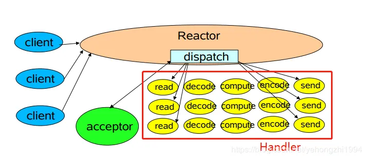
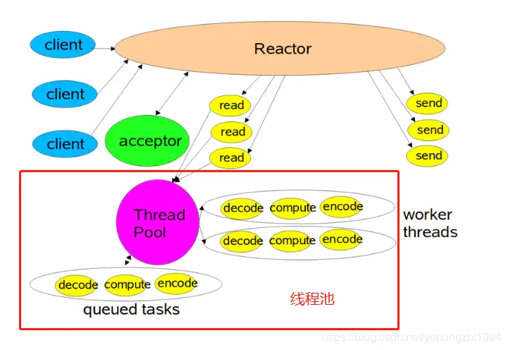
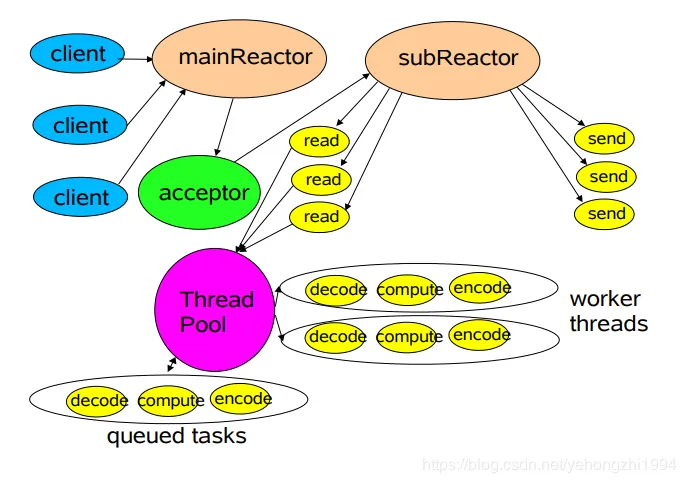

[TOC]

### Reactor-简介

- [参考](https://mp.weixin.qq.com/s/vWbbn1qXRFVva8Y9yET18Q?spm=a2c6h.12873639.0.0.53064a61EZbu2G)
- Reactor 是事件驱动模型的一种实现

### 主要角色

- Reactor：负责响应事件，将事件分发到绑定了对应事件的Handler，如果是连接事件，则分发到Acceptor。
- Handler：事件处理器。负责执行对应事件对应的业务逻辑。
- Acceptor：绑定了 connect 事件，当客户端发起connect请求时，Reactor会将accept事件分发给Acceptor处理。

### 三种形式

#### 1. 单Reactor单线程

- 

##### 工作流程

- 只有一个select循环接收请求，
- 客户端（client）注册进来由Reactor接收注册事件，
- 然后再由reactor分发（dispatch）出去，由下面的处理器（Handler）去处理。

##### 特点

- 单线程的问题实际上是很明显的。
    - 只要其中一个Handler方法阻塞了，那就会导致所有的client的Handler都被阻塞了，
    - 也会导致注册事件也无法处理，无法接收新的请求。
    - 所以这种模式用的比较少，因为不能充分利用到多核的资源。
- 这种模式仅仅只能处理Handler比较快速完成的场景。

#### 2. 单Reactor多线程

- 

##### 工作流程

- 在多线程Reactor中，注册接收事件都是由Reactor来做，
- 其它的计算，编解码由一个线程池来做。
- 从图中可以看出工作线程是多线程的，监听注册事件的Reactor还是单线程。

##### 特点

- 对比单线程Reactor模型，
- 多线程Reactor模式在Handler读写处理时，交给工作线程池处理，不会导致Reactor无法执行，
- 因为Reactor分发和Handler处理是分开的，能充分地利用资源。从而提升应用的性能。

##### 缺点

- Reactor只在主线程中运行，承担所有事件的监听和响应，如果短时间的高并发场景下，依然会造成性能瓶颈。

#### 3. 多Reactor多线程

- 

##### 工作流程

1. mainReactor负责监听客户端请求，专门处理新连接的建立，将建立好的连接注册到subReactor。
2. subReactor 将分配的连接加入到队列进行监听，当有新的事件发生时，会调用连接相对应的Handler进行处理。

##### 特点

- mainReactor 主要是用来处理客户端请求连接建立的操作。
    - subReactor主要做和建立起来的连接做数据交互和事件业务处理操作，每个subReactor一个线程来处理。
- 这样的模型使得每个模块更加专一，耦合度更低，能支持更高的并发量。
- 许多框架也使用这种模式，比如接下来要讲的Netty框架就采用了这种模式。

