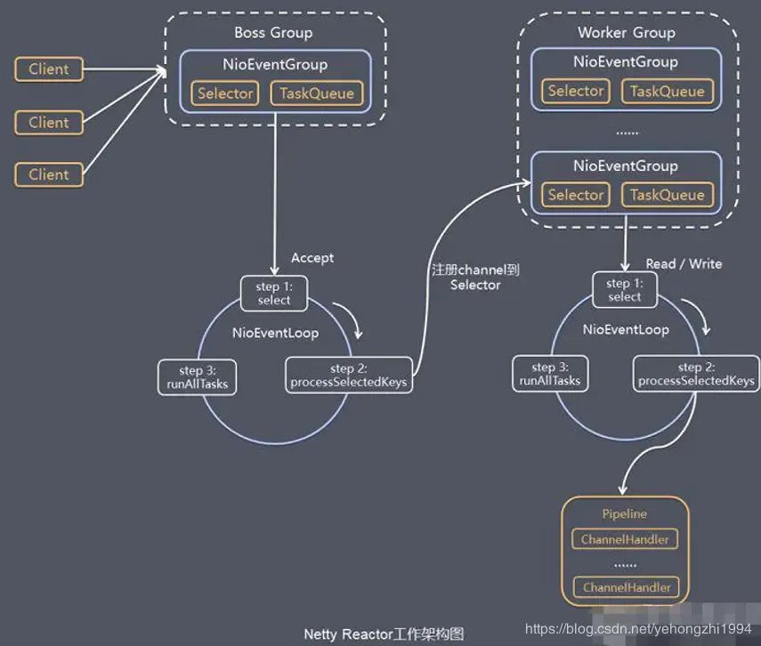

[TOC]

### Reactor在Netty中的应用

- 

1. BossGroup相当于mainReactor，负责建立连接并且把连接注册到WorkGroup中。WorkGroup负责处理连接对应的读写事件。
2. BossGroup和WorkGroup是两个线程池，里面有多个NioEventGroup(实际上是线程)，默认BossGroup和WorkGroup里的线程数是cpu核数的两倍（源码中有体现）。
3. 每一个NioEventGroup都是一个无限循环，负责监听相对应的事件。
4. Pipeline(通道)里包含多个ChannelHandler(业务处理)，按顺序执行。

