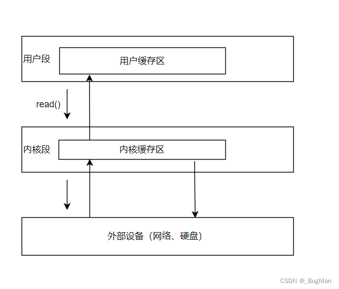
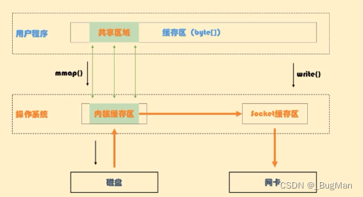
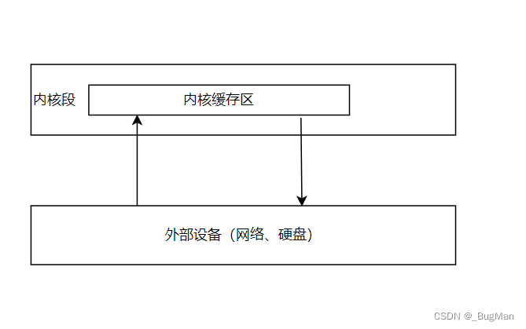

[TOC]

- [全网最清晰的零拷贝详解](https://blog.csdn.net/Joker_ZJN/article/details/131841573)
- [Java nio包SocketChannel详解](https://blog.csdn.net/TreeShu321/article/details/134793370)

### 1.基础知识

#### 1.1.内存分段和CPU的态

- 现代计算机在加载操作系统、正常启动后，其内存会主要分成两大段：
    - 内核段
    - 用户段
- **内核段**
- 操作系统本质上是一个计算机的管理程序，该程序相关的所有资源，被存放在内核段中。
- **用户段**
- 用户段用来存放各个进程的数据和指令。
- 根据所访问的内存段的不同，CPU会处于不同的态，访问用户段的时候处于用户态，访问内核段的时候处于内核态。

#### 1.2.计算机IO的过程

#### 1.3.IO与内存

### 2.零拷贝

- 零拷贝（Zero-copy）是一种优化技术，
- 并不是一次拷贝都不做，而是旨在减少数据在系统内部的复制操作，从而提高数据传输的效率。
- 它的主要目标是减少内存到内存之间的数据拷贝。
- 零拷贝有两种实现方式：

#### 2.1.MMap

- 通过上文我们知道一次IO，数据会进行四次拷贝，
- MMap这种方式在将内核段中的数据拷贝到用户段的这次拷贝中，拷贝的不是数据，而是数据的映射，
- 这样在用户段中进行数据处理完后，就不必再从用户段拷贝回内核段，从而减少了一次拷贝。
- 
- 之所以能实现这样的效果是得益于操作系统底层有两种读操作：

##### 读取数据：

- 常见的系统调用如 read()（用于文件描述符）或 recv()（用于套接字）用于从文件或套接字中读取数据。
- 这些系统调用从相应的输入源（如磁盘、网络等）读取数据，并将其复制到应用程序提供的缓冲区中。
- 这种方式涉及了数据的复制，因为数据需要从内核态复制到用户态缓冲区中。

##### 读取映射：

- 另一种方式是通过内存映射（Memory Mapping）来实现读取操作。
- 通过将文件或设备的数据映射到进程的内存区域中，应用程序可以直接访问内存映射区域中的数据，而无需使用传统的 read() 系统调用。
- 在这种情况下，应用程序可以通过直接读取内存映射区域中的数据来获取文件或设备的内容，避免了中间的数据复制。

##### 特别说明：

- 这里为了涵盖，本地IO和网络IO两种情况，内核段没拆成几个设备的不同地址空间，
- 但是如果是从磁盘中读，然后向网络中写，是跨了IO设备的，所以中间有个内核段地址间的复制过程，如下图：
- 

#### 2.2.SendFile

- SendFile更狠，直接就不走用户段，直接就是从内核段的一个内存地址复制到另一个内存地址，
- 主要是拿来进行网络传输的，从本地磁盘读数据，读到一个地址里，然后将这个地址里的数据复制给另一个IO设备的地址，这个地址就可以是网络IO的地址。
- 很明显sendFile有一个弊病，就是没走用户段的话，数据没办法处理，
- 所以其只是一种用于实现数据传输的 "零拷贝" 技术，而不能直接进行数据处理。并且SendFile还存在大小限制。
- 

### 3.JAVA中的零拷贝

- 零拷贝需要进行系统调用才能实现，很明显要我们手写实现零拷贝是很底层、很麻烦的，好在JAVA在NIO中封装了mmap、SendFile两种零拷贝的API，
- 当我们想在JAVA中使用零拷贝时，直接调API即可。
- JavaNlO中 的Channel就相当于操作系统中的内核缓冲区，而Buffer就相当于操作系统中的用户缓冲区。
- SpringIOSpringBoot
    - cc-test
    - cc-test-io

