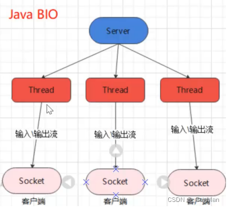

[TOC]

### 2. 什么是BIO

- BIO，同步阻塞，即传统的JAVA IO，相关类和接口在java.io包下，其线程模型如下：
- 
- IO的线程模型呈现出以下特点：
- 一个连接一个线程，每个连接进来都对应着需要新启一个线程去负责处理该连接，可能出现处理连接的 线程被执行时所需的IO资源未准备好，造成线程被阻塞的情况出现。
- server端处理连接的请求一旦被阻 塞，client也会因为收不到响应而阻塞，因此client端、server端呈现出同步阻塞的特点。

