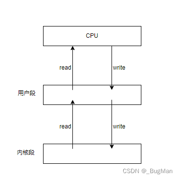

### 计算机的IO模型

- 在聊IO之前一定要了解计算机的IO模型，因为编程语言的所有和IO有关的API，本质上一定是对于计算机IO模型的抽象。
- 计算机的IO其实就是在内存中为各个IO设备分配了属于它的一块内存，向这块内存中进行读写即可完成IO。这块内存是位于计算机内存中的内核段中的。
- 一次完整的IO过程是：

1. CPU执行IO指令
2. 将内核段中数据读到用户段
3. 用户段中数据交给CPU
4. CPU的执行结果写回用户段
5. 用户段中存的结果写回内核段

- 

