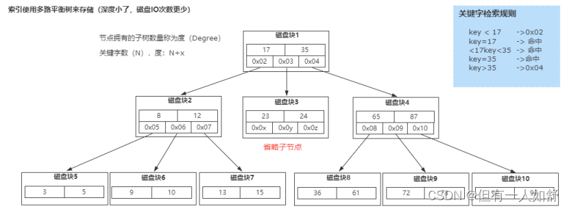

### Mysql为什么使用B+Tree作为索引结构

- 首先，常规的数据库存储引擎，一般都是采用B树或者B+树来实现索引的存储。
- 因为B树是一种多路平衡树，用这种存储结构来存储大量数据，它的整个高度会相比二叉树来说，会矮很多。
- 
- 而对于数据库来说，所有的数据必然都是存储在磁盘上的，而磁盘IO的效率实际上是很低的，特别是在随机磁盘IO的情况下效率更低。
- 所以树的高度能够决定磁盘IO的次数，磁盘IO次数越少，对于性能的提升就越大，这也是为什么采用B树作为索引存储结构的原因。
- 但是在Mysql的InnoDB存储引擎里面，它用了一种增强的B树结构，也就是B+树来作为索引和数据的存储结构。
- 相比较于B树结构，B+树做了几个方面的优化。

1. B+树的所有数据都存储在叶子节点，非叶子节点只存储索引。
2. 叶子节点中的数据使用双向链表的方式进行关联。

### 使用B+树来实现索引的原因，我认为有几个方面。

1. B+树非叶子节点不存储数据，所以每一层能够存储的索引数量会增加，意味着B+树在层高相同的情况下存储的数据量要比B树要多，使得磁盘IO次数更少。
2. 在Mysql里面，范围查询是一个比较常用的操作，而B+树的所有存储在叶子节点的数据使用了双向链表来关联，所以在查询的时候只需查两个节点进行遍历就行，而B树需要获取所有节点，所以B+树在范围查询上效率更高。
3. 在数据检索方面，由于所有的数据都存储在叶子节点，所以B+树的IO次数会更加稳定一些。
4. 因为叶子节点存储所有数据，所以B+树的全局扫描能力更强一些，因为它只需要扫描叶子节点。但是B树需要遍历整个树。

- 另外，基于B+树这样一种结构，如果采用自增的整型数据作为主键，还能更好的避免增加数据的时候，带来叶子节点分裂导致的大量运算的问题。
- 技术方案的选型，更多的是去解决当前场景下的特定问题，并不一定是说B+树就是最好的选择，就像MongoDB里面采用B树结构，本质上来说，其实是关系型数据库和非关系型数据库的差异。

