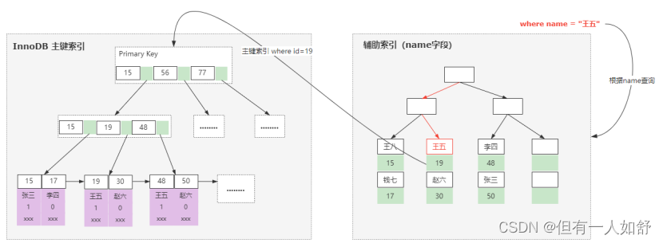

### 什么是聚集索引和非聚集索引

- 简单来说，聚集索引就是基于主键创建的索引，除了主键索引以外的其他索引，称为非聚集索引，也叫做二级索引。
- 由于在InnoDB引擎里面，一张表的数据对应的物理文件本身就是按照B+树来组织的一种索引结构，而聚集索引就是按照每张表的主键来构建一颗B+树，然后叶子节点里面存储了这个表的每一行数据记录。
- 所以基于InnoDB这样的特性，聚集索引并不仅仅是一种索引类型，还代表着一种数据的存储方式。
- 同时也意味着每个表里面必须要有一个主键，如果没有主键，InnoDB会默认选择或者添加一个隐藏列作为主键索引来存储这个表的数据行。
- 一般情况是建议使用自增id作为主键，这样的话id本身具有连续性使得对应的数据也会按照顺序存储在磁盘上，写入性能和检索性能都很高。否则，如果使用uuid这种随机id，那么在频繁插入数据的时候，就会导致随机磁盘IO，从而导致性能较低。
- 需要注意的是，InnoDB里面只能存在一个聚集索引，原因很简单，如果存在多个聚集索引，那么意味着这个表里面的数据存在多个副本，造成磁盘空间的浪费，以及数据维护的困难。
- （如图）由于在InnoDB里面，主键索引表示的是一种数据存储结构，所以如果是基于非聚集索引来查询一条完整的记录，最终还是需要访问主键索引来检索。
- 

