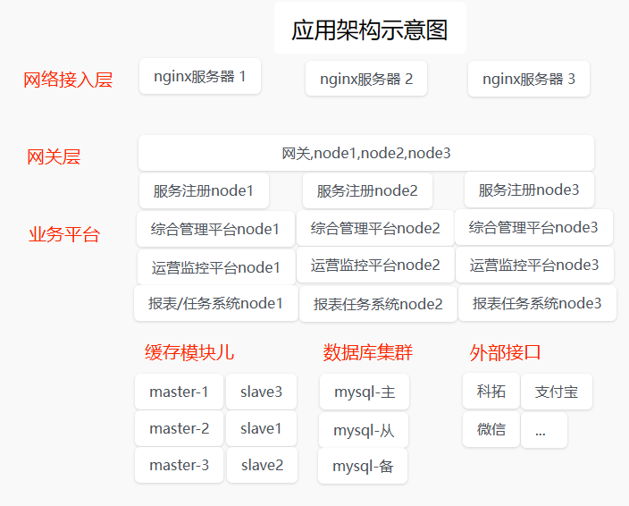

### 一. 系统技术选型

#### 为什么选择mysql

1. 性能对比，oracle虽然在某些方面性能更优，但是mysql作为轻量级的数据库已经能够满足系统使用
2. 成本，mysql是开源免费的，oracle使用成本更高，mysql可以降低运营成本
3. 易扩展，mysql开源特性是的其更具有扩展性，可以随着业务需求增长轻松的进行扩展，维护更多实例保证数据安全和高可用。

#### 为什么选择redis

- 丰富的数据类型，可以将各种常用的业务数据放入redis，提高响应速度
- 支持数据备份，数据丢失后可以用过aof恢复
- 分布式存储，redis支持分布式存储功能，采用三主三从的模式，保证单点故障下的数据可用性。
- 易扩展，无中心节点，具有线性伸缩功能

#### 为什么选择SpringCloud

- 提供了分布式系统中的各个组件，能够相互协调工作
- 易于开发和维护，支持一键启动和部署
- 解耦和隔离，通过服务注册中心实现对系统解耦和隔离
- 高可用，提供了断路器，服务熔断等机制，即使某个服务出现故障或者宕机，其他服务仍然可以继续运行
- 解决方案多，社区庞大，面对各种业务情况，都有常见的解决方案

### 二. 架构示意图

- 

### 三. 高可用保障机制

#### 3.1 系统

- 对外暴露3台nginx服务地址，每台服务通过权重映射3个网关服务，网关通过openfeign调用服务接口。
- 每个微服务保证在注册中心至少注册3个实例，并且实例不属于同一台物理服务器，注册中心也会部署在不同的服务器

#### 3.2 数据库

- 数据库采用 主-从-备,保证高可用
- 主节点负责读写，从节点负责读取，备节点负责定时备份数据

#### 3.3 缓存

- 使用redis作为缓存中间件
- Redis Cluster至少配置三个主节点，三个从节点
- 由于CRC16算法，主节点之间不会保存冗余数据，由从节点冗余
- 通过负载均衡，使缓存均匀的分布在不同的节点，如果主节点宕机，从节点会自动升级为主节点，保证高可用

