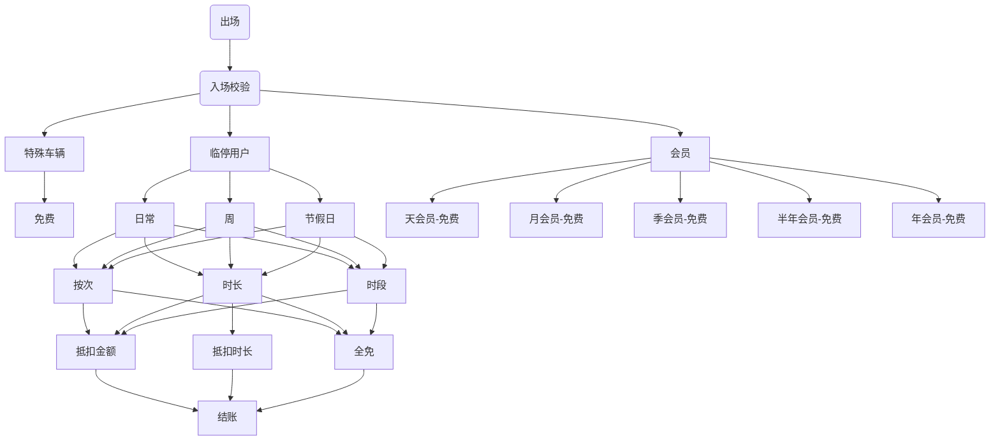

- 出场流程

```mermaid
graph TB
A1-1(出场)-->A2-1(入场校验)
A2-1-->A3-1[特殊车辆]
A2-1-->A3-2[临停用户]
A2-1-->A3-3[会员]
A3-1-->A4-1[免费]
A3-2-->A4-7[日常]
A3-2-->A4-8[周]
A3-2-->A4-9[节假日]
A3-3-->A4-2[天会员-免费]
A3-3-->A4-3[月会员-免费]
A3-3-->A4-4[季会员-免费]
A3-3-->A4-5[半年会员-免费]
A3-3-->A4-6[年会员-免费]
A4-7-->A5-1[按次]
A4-7-->A5-2[时长]
A4-7-->A5-3[时段]
A4-8-->A5-1[按次]
A4-8-->A5-2[时长]
A4-8-->A5-3[时段]
A4-9-->A5-1[按次]
A4-9-->A5-2[时长]
A4-9-->A5-3[时段]
A5-1-->A6-1[抵扣金额]
A5-1-->A6-3[全免]
A5-2-->A6-1[抵扣金额]
A5-2-->A6-2[抵扣时长]
A5-2-->A6-3[全免]
A5-3-->A6-1[抵扣金额]
A5-3-->A6-3[全免]
A6-1-->A7-1[结账]
A6-2-->A7-1[结账]
A6-3-->A7-1[结账]
```

