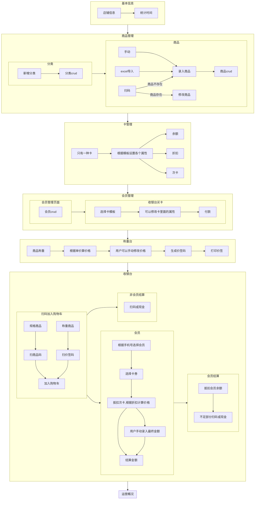

```mermaid
  flowchart TB
    subgraph 基本信息
      direction LR
      店铺信息 --> 统计时间
    end
    subgraph 商品管理
      direction LR
      subgraph 分类
        direction LR
        新增分类 --> 分类crud
        end
      subgraph 商品
        direction LR
        手动 --> 录入商品
        excel导入 --> 录入商品
        扫码 -- 商品不存在 --> 录入商品
        扫码 -- 商品存在 --> 修改商品
        录入商品 --> 商品crud
        end
    end
        分类 --> 商品
    subgraph 卡管理
        direction LR
        只有一种卡 --> 根据模板设置各个属性
        根据模板设置各个属性 --> 余额 
        根据模板设置各个属性 --> 折扣
        根据模板设置各个属性 --> 次卡
end
    subgraph 会员管理
        direction LR
        subgraph 会员管理页面
            direction LR
            会员crud
        end
        subgraph 收银台买卡
            direction LR
            选择卡模板 --> 可以修改卡里面的属性 --> 付款
        end
    end
        会员管理页面 --> 收银台买卡
    subgraph 称重台
        direction LR
            direction LR
            商品称重 --> 根据单价算价格 --> 用户可以手动修改价格 --> 生成价签码  --> 打印价签
    end
    subgraph 收银台
      direction LR
      subgraph 扫码加入购物车
        direction TB
         规格商品 --> 扫商品码 --> 加入购物车 
         称重商品 --> 扫价签码 --> 加入购物车 
      end
      subgraph 会员
        direction TB
        根据手机号选择会员 --> 选择卡券 --> 抵扣次卡,根据折扣计算价格
          抵扣次卡,根据折扣计算价格 --> 结算金额
          抵扣次卡,根据折扣计算价格 --> 用户手动录入最终金额 --> 结算金额
      end
      subgraph 会员结算
        direction TB
        抵扣会员余额 --> 不足部分扫码或现金
      end
      subgraph 非会员结算
        direction TB
        扫码或现金 
      end
        扫码加入购物车 --> 会员 --> 会员结算
        扫码加入购物车 --> 非会员结算
    end
    subgraph 运营概况
        direction LR
    end
    基本信息 --> 商品管理 --> 卡管理 --> 会员管理 --> 称重台 --> 收银台 --> 运营概况
```

