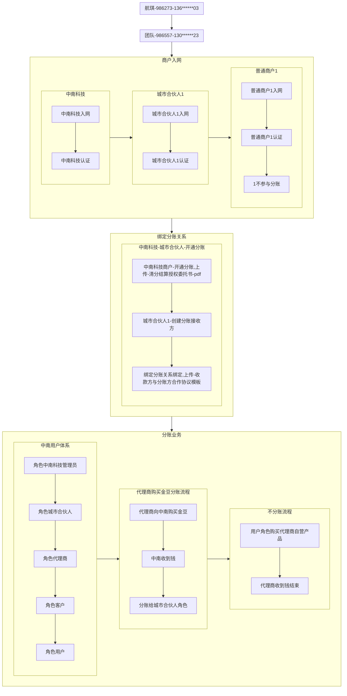

```mermaid
  flowchart TB
    subgraph 航琪-986273-136******03
    end
    subgraph 团队-986557-130******23
    end
    subgraph 商户入网
        direction LR
        subgraph 普通商户1
            direction TB
            普通商户1入网 --> 普通商户1认证 --> 1不参与分账
        end
        subgraph 中南科技
            direction TB
            中南科技入网 --> 中南科技认证
        end
        subgraph 城市合伙人1
            direction TB
            城市合伙人1入网 --> 城市合伙人1认证
        end
        中南科技 --> 城市合伙人1 --> 普通商户1
    end
    subgraph 绑定分账关系
        direction LR
        subgraph 中南科技-城市合伙人-开通分账
            direction TB
            中南科技商户-开通分账,上传-清分结算授权委托书-pdf --> 城市合伙人1-创建分账接收方 --> 绑定分账关系绑定,上传-收款方与分账方合作协议模板
        end
    end
    subgraph 分账业务
        direction LR
        subgraph 中南用户体系
            direction TB
            角色中南科技管理员 --> 角色城市合伙人 --> 角色代理商 --> 角色客户 --> 角色用户
        end
        subgraph 代理商购买金豆分账流程
            direction TB
            代理商向中南购买金豆 --> 中南收到钱 --> 分账给城市合伙人角色
        end
        subgraph 不分账流程
            direction TB
            用户角色购买代理商自营产品 --> 代理商收到钱结束
        end
        中南用户体系 --> 代理商购买金豆分账流程 --> 不分账流程
    end
    航琪-986273-136******03 --> 团队-986557-130******23 --> 商户入网 --> 绑定分账关系 --> 分账业务
```

### 航旗

- 和拉卡拉签协议(手续费)，系统里面不体现,

### 问题

- [ ] 中南科技入网后，结算信息位对公，如何操作让非法人认证支付宝微信
- [ ] 清分结算授权委托书-pdf，每次新入网，一个商户，新生成一个pdf
    - [ ] 报错提示合作方用，城市合伙人，是不是以后新的合伙人，不用再执行第一步[商户开通分账]
    - [ ] 待测试

