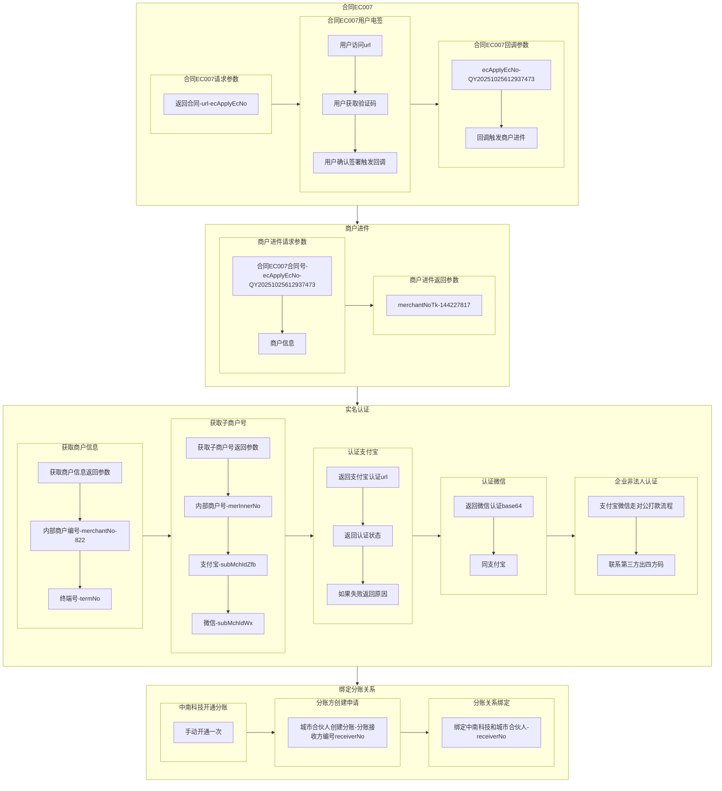

### 商户进件流程

```mermaid
  flowchart TB
    subgraph 合同EC007
        subgraph 合同EC007请求参数
            direction TB
            返回合同-url-ecApplyEcNo
        end
        subgraph 合同EC007用户电签
            direction TB
            用户访问url --> 用户获取验证码 --> 用户确认签署触发回调
        end
        subgraph 合同EC007回调参数
            direction TB
            ecApplyEcNo-QY20251025612937473 --> 回调触发商户进件
        end
        合同EC007请求参数 --> 合同EC007用户电签 --> 合同EC007回调参数
    end
    subgraph 商户进件
        subgraph 商户进件请求参数
            direction TB
            合同EC007合同号-ecApplyEcNo-QY20251025612937473 --> 商户信息
        end
        subgraph 商户进件返回参数
            direction TB
            merchantNoTk-144227817
        end
        商户进件请求参数 --> 商户进件返回参数
    end
    subgraph 实名认证
        direction LR
        subgraph 获取商户信息
            direction TB
            获取商户信息返回参数 --> 内部商户编号-merchantNo-822 --> 终端号-termNo
        end
        subgraph 获取子商户号
            direction TB
            获取子商户号返回参数 --> 内部商户号-merInnerNo --> 支付宝-subMchIdZfb --> 微信-subMchIdWx
        end
        subgraph 认证支付宝
            direction TB
            返回支付宝认证url --> 返回认证状态 --> 如果失败返回原因
        end
        subgraph 认证微信
            direction TB
            返回微信认证base64 --> 同支付宝
        end
        subgraph 企业非法人认证
            direction TB
            支付宝微信走对公打款流程 --> 联系第三方出四方码
        end
        获取商户信息 --> 获取子商户号 --> 认证支付宝 --> 认证微信 --> 企业非法人认证
    end
    subgraph 绑定分账关系
        direction LR
        subgraph 中南科技开通分账
            direction TB
            手动开通一次
        end
        subgraph 分账方创建申请
            direction TB
            城市合伙人创建分账-分账接收方编号receiverNo
        end
        subgraph 分账关系绑定
            direction TB
            绑定中南科技和城市合伙人-receiverNo
        end
        中南科技开通分账 --> 分账方创建申请 --> 分账关系绑定
    end
    合同EC007 --> 商户进件 --> 实名认证 --> 绑定分账关系
```

### 普通支付流程

### 分账支付流程

