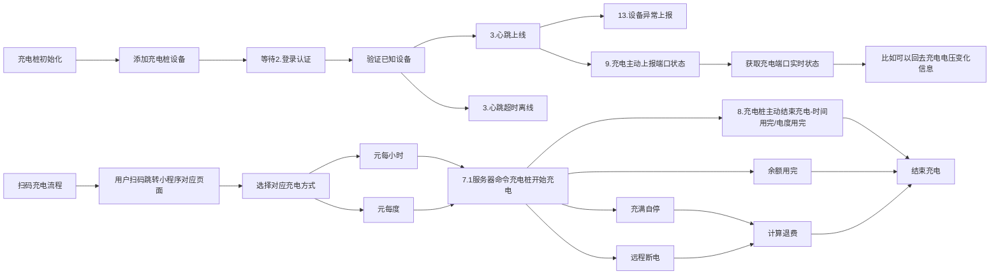



[TOC]

### 1. 问题说明

1. 添加充电桩设备
2. 设备心跳上线
3. 设置充电桩参数

#### 1.1. 充电桩初始化

- 设备 ID
- sim 卡号

#### 1.2. 扫码充电流程

1. 扫码跳转小程序对应充电桩页面
   - 码里面包含分组信息，设备 id
2. 选择充电方式

#### 1.3. 订单流程

### 2. 流程图

- 完善判断流程

```mermaid
graph LR
    充电桩初始化 --> 添加充电桩设备
    添加充电桩设备 --> 等待2.登录认证
    等待2.登录认证 --> 验证已知设备
    验证已知设备 --> 3.心跳上线
    验证已知设备 --> 3.心跳超时离线
    3.心跳上线 --> 13.设备异常上报
    3.心跳上线 --> 9.充电主动上报端口状态
    9.充电主动上报端口状态 --> 获取充电端口实时状态
    获取充电端口实时状态 --> 比如可以回去充电电压变化信息

    扫码充电流程 --> 用户扫码跳转小程序对应页面
    用户扫码跳转小程序对应页面 --> 选择对应充电方式
    选择对应充电方式 --> 元每小时
    选择对应充电方式 --> 元每度
    元每小时 --> 7.1服务器命令充电桩开始充电
    元每度 --> 7.1服务器命令充电桩开始充电
    7.1服务器命令充电桩开始充电 --> 8.充电桩主动结束充电-时间用完/电度用完
    7.1服务器命令充电桩开始充电 --> 余额用完
    7.1服务器命令充电桩开始充电 --> 充满自停
    7.1服务器命令充电桩开始充电 --> 远程断电
    8.充电桩主动结束充电-时间用完/电度用完 --> 结束充电
    余额用完 --> 结束充电
    充满自停 --> 计算退费
    远程断电 --> 计算退费
    计算退费 --> 结束充电


```

