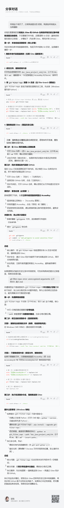



### 为什么

- 误提交 jar大文件
- 误提交 敏感信息
- 需要永久删除

### 流程

~~~shell
# 安装 git-filter-repo（Windows 用 pip，需先装 Python）
pip install git-filter-repo

# 清理指定文件中的密钥（彻底删除历史提交中的该文件记录）
git filter-repo --replace-text <(echo "你的AccessKey ID")  # 替换成实际的ID
git filter-repo --replace-text <(echo "你的AccessKey Secret")  # 替换成实际的Secret

# 或直接删除包含密钥的文件（如果该文件只有密钥需要删）
#git filter-repo --path doc_java_project_znkj/34. 云千呼/01. 简介.md --invert-paths
# 上面的脚本会有 转义 问题 应该是空格导致的
git filter-repo --path "doc_java_project_znkj/34. 云千呼/01. 简介.md" --invert-paths

git push gitee v_1 --force  # 强制推送清理后的代码到Gitee
~~~

#### 增加 .gitignore

~~~text
# 忽略包含密钥的文件
doc_java_project_znkj/34. 云千呼/01. 简介.md
# 通用敏感文件
*.key
*.secret
*.credentials
config/
~~~

### 原始

- [原问答记录](https://www.doubao.com/thread/w9ecd9c38715cf234)
- 

