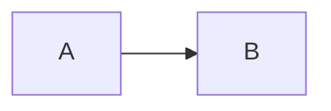
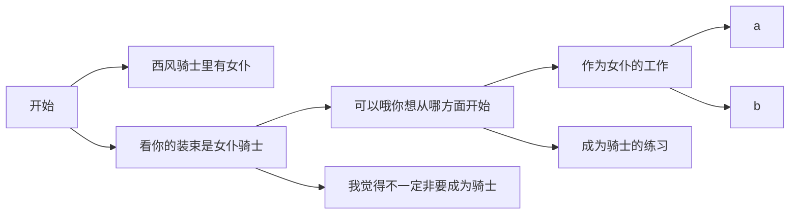
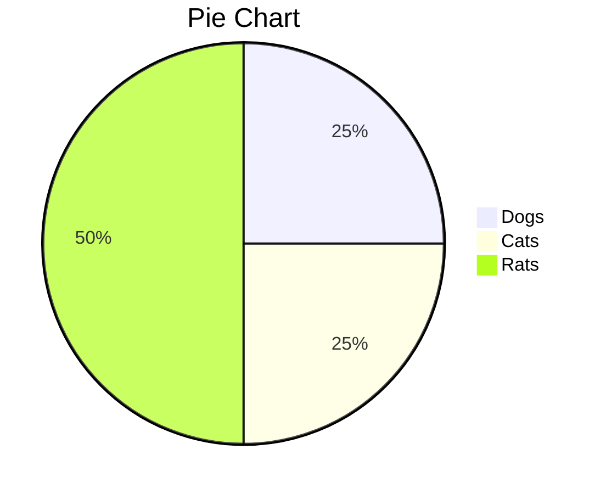
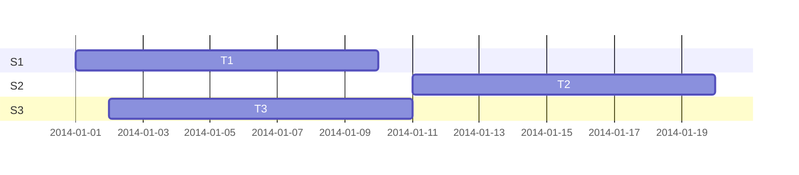
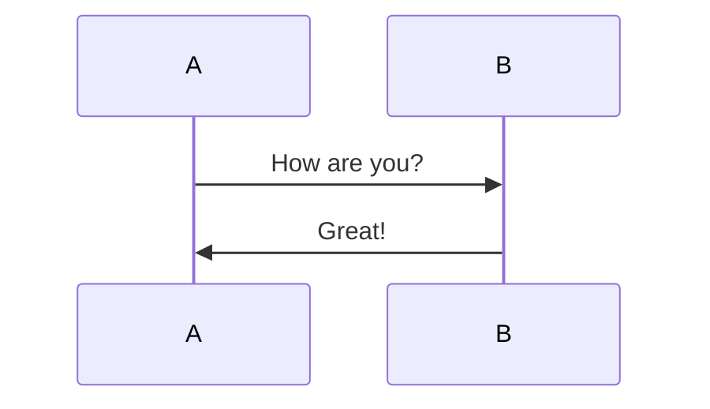

[TOC]

### graph TD LR

- LR横版，TD竖版
- TB—top bottom（自上而下）
- BT—bottom top（自下而上）
- RL—right left（从右到左）
- LR—left right（从左到右）

~~~mermaid
graph TD
    id[带文本的矩形]
    id4(带文本的圆角矩形)
    id3>带文本的不对称的矩形]
    id1{带文本的菱形}
    id2((带文本的圆形))
~~~

---

~~~mermaid
graph TD
    A --> B
~~~

---

---

### pie

### gantt

### sequenceDiagram

