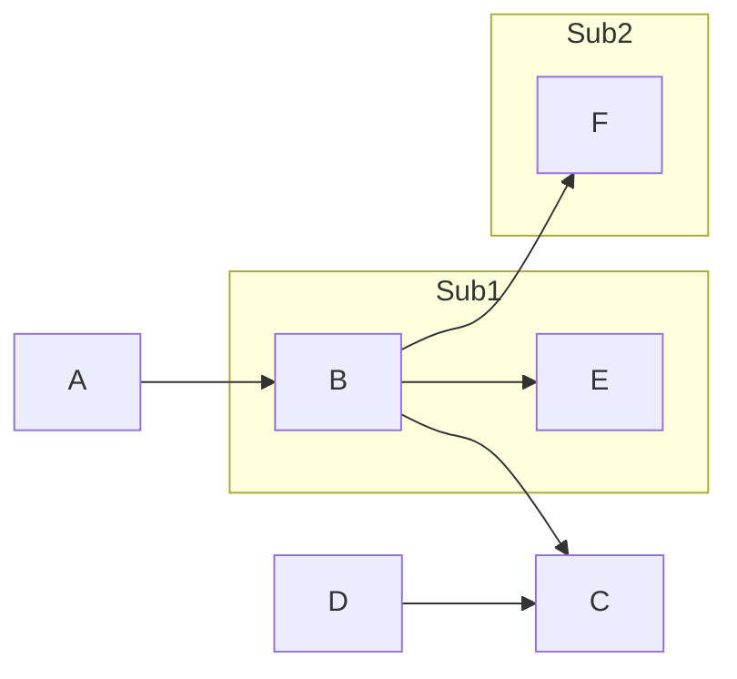
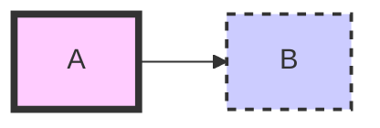

- 取决于markdown版本,git上或者 typora 可以打开

### 5. Subgraph 子图 画一个区域?

- 子图?
- 区域图

```mermaid
graph LR
    A --> B
    B --> C
    D --> C

    subgraph Sub1
        B --> E
    end

    subgraph Sub2
        B --> F
    end
```

### 6. Style 样式

- 上个色

```mermaid
graph LR
    style A fill: #f9f, stroke: #333, stroke-width: 4px, fill-opacity: 0.5
    style B fill: #ccf, stroke: #333, stroke-width: 2px, fill-opacity: 1, stroke-dasharray: 5, 5

A-->B
```

