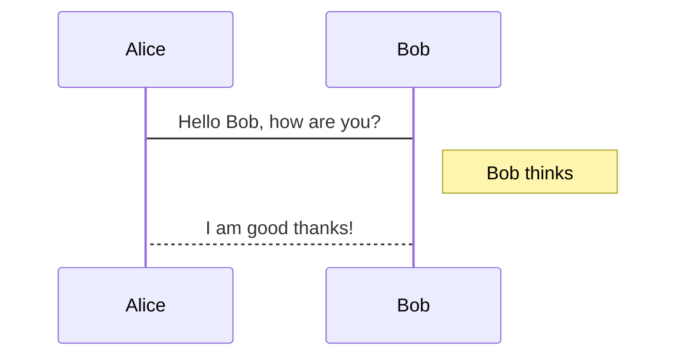

<span  style="font-family: Simsun,serif; font-size: 17px; ">

[TOC]

### sequence 简化语法

- sequence

```sequence
Alice->Bob: Hello Bob, how are you?
Note right of Bob: Bob thinks
Bob-->Alice: I am good thanks!
```

---



</span>