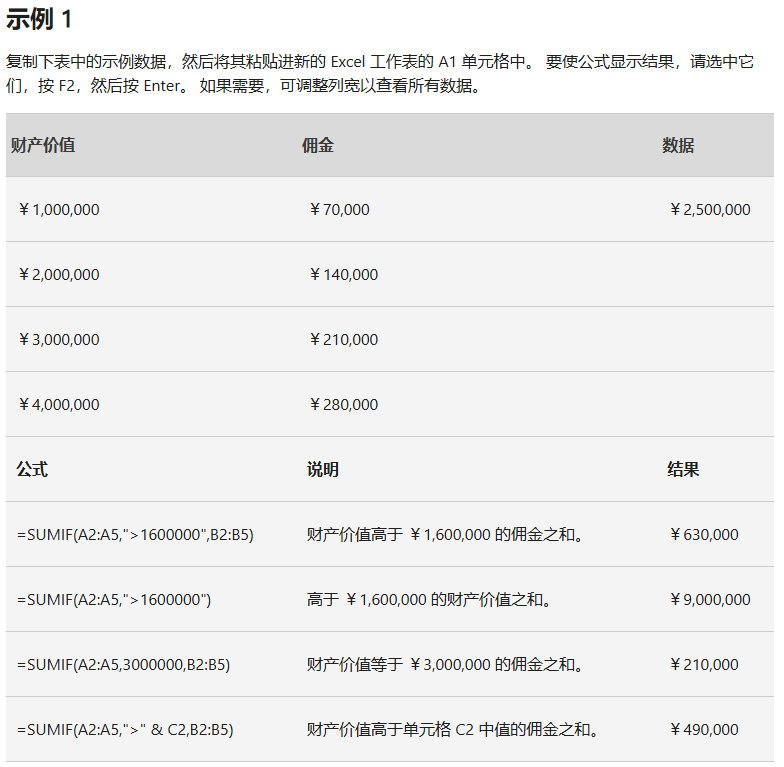
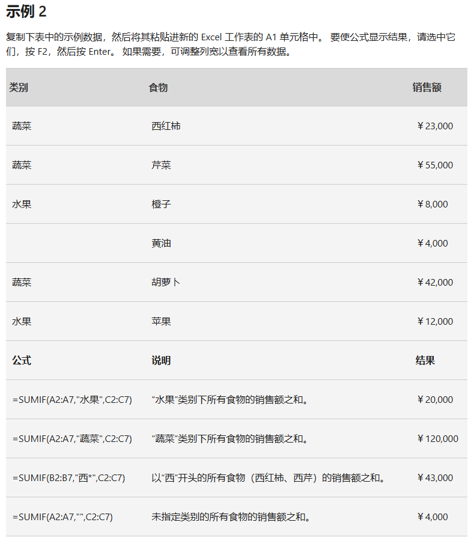

- [=SUMIF()](https://support.microsoft.com/zh-cn/office/sumif-%E5%87%BD%E6%95%B0-169b8c99-c05c-4483-a712-1697a653039b)

### 语法

~~~
SUMIF(range, criteria, [sum_range])
~~~

#### SUMIF 函数语法具有以下参数：

##### range 范围

- 必需。 希望通过标准评估的单元格范围。 每个范围内的单元格必须是数字或名称、数组或包含数字的引用。 空白和文本值将被忽略。 选定的范围可以包含标准Excel格式的日期（如下例）。

##### criteria

- 必需。 criteria 以数字、表达式、单元格参考、文本或函数的形式来定义将添加哪些单元格。
    - 可包括的通配符字符 - 问号（？）以匹配任意单个字符，星号（*）以匹配任意字符序列。
    - 如果要查找实际的问号或星号，请在该字符前键入波形符（~）。
- 例如，criteria可以表示为 32、“>32”、B5、“3？”、“苹果*”、“*~？”或 今天（）。
- **重要:** 任何文本条件或任何含有逻辑或数学符号的条件都必须使用双引号 (") 括起来。 如果条件为数字，则无需使用双引号。

##### sum_range 可选

- 要添加的实际单元格，如果要添加在范围参数指定以外的其他单元格。 如果省略sum_range参数，Excel就会添加范围参数中指定的单元格（与应用标准的单元格相同）。
- Sum_range 的大小和形状应该与范围相同。
    - 如果不这样做，性能可能会受到影响，而且该公式将对从sum_range中第一个单元格开始的单元格范围进行求和，但其尺寸与范围相同。

### 示例

~~~
=SUMIF(D26:D38,"每日",D26:D38)
~~~

- 更多的示例参考官网
- 
- 

